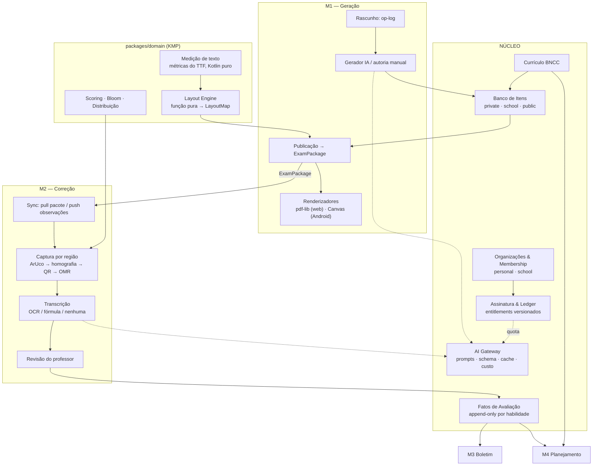

# Arquitetura Final — v3

**Plataforma de Avaliação Educacional com IA**
**Data:** 2026-08-13 · **Mantenedor:** 1 pessoa · **Status:** alinhada, pronta para virar ADRs e specs

> Este documento substitui a v1, a v2 e o documento de design. É a referência única.
> As decisões aqui são invariantes: mudá-las exige um ADR novo, não uma conversa.

---

## 0. Como usar este documento

| Se você quer… | Vá para |
|---|---|
| Entender o sistema inteiro em 5 minutos | §1 e §2 |
| Saber por que uma coisa é do jeito que é | §17 (registro de decisões) |
| Implementar | §15 (roadmap), depois a spec da fatia |
| Modelar o banco | §11 |
| Entender a folha impressa | §7, §8 e `mockup-prova.html` |

---

## 1. O sistema em uma página

Quatro módulos sobre um núcleo comum:

| Módulo | O que faz | Status |
|---|---|---|
| **M1 — Geração** | Cria provas (IA ou manual), publica o `ExamPackage`, renderiza o PDF | Especificado |
| **M2 — Correção** | Captura por região, OMR offline, correção discursiva opcional por IA | Especificado |
| **M3 — Boletim** | Agrega desempenho por habilidade e período | Preparado, não especificado |
| **M4 — Planejamento** | Gera plano de aula a partir das lacunas da turma | Preparado, não especificado |

**A tese central da arquitetura:** M3 e M4 não são módulos novos — são **leituras** sobre fatos que M1 e M2 produzem. Se as três invariantes de §2 forem respeitadas, eles custam prompts e read models, não re-arquitetura.

---

## 2. As três invariantes

Tudo o mais é negociável. Estas não são.

**I1 — Toda questão nasce marcada por habilidade da BNCC.**
Sem isso, boletim por competência e diagnóstico de turma são impossíveis, e retro-marcar milhares de questões geradas é caro e impreciso.

**I2 — Resultados são fatos append-only atribuídos a habilidade.**
`assessment_fact(aluno, habilidade, avaliação, pontos, período)`. M3 vira `GROUP BY`. M4 vira "quais habilidades estão abaixo do limiar". Nenhuma tabela nova.

**I3 — Todo artefato gerado por IA carrega `prompt_version` + `model_id` + `params_hash`.**
Prompts vivem em arquivos no Git. Sem isso não há reprodutibilidade, auditoria de contestação de nota, nem controle de regressão.

---

## 3. Tenancy, planos e a trajetória para Enterprise

### 3.1 O problema da migração — e por que ele não vai existir

A preocupação é legítima: se o professor "pertence" a uma organização pessoal e um dia precisa "virar" membro de uma escola, isso é uma migração de dados dolorosa — re-parentear linhas, quebrar RLS no meio do caminho, deduplicar alunos, reconciliar assinatura.

**O atrito só existe se você assumir que o professor precisa *mudar de lugar*.** A saída é modelar pertencimento em vez de propriedade:

> **`membership` N:N — um usuário pode pertencer a várias organizações simultaneamente.**

É o modelo do GitHub (conta pessoal + organizações) e do Slack (múltiplos workspaces). Com ele, "entrar numa escola" deixa de ser migração e vira **inserção de uma linha**:

| Momento | O que acontece |
|---|---|
| Cadastro | Cria `organization(kind: personal)` + `membership(user, org, role: owner)` |
| Escola contrata | Cria `organization(kind: school)`; admin convida professores |
| Professor aceita | Insere `membership(user, school_org, role: teacher)`. **Nada é movido.** |
| Trabalho novo | Acontece na organização da escola (seletor de contexto na UI) |
| Acervo antigo | Continua na organização pessoal, acessível. Itens podem ser **copiados** para a escola sob demanda, com proveniência via `source_item_id` (já previsto em D5) |

Nenhum UPDATE em massa, nenhuma janela de inconsistência, nenhum aluno duplicado forçado.

### 3.2 As duas regras que preservam isso

1. **Toda tabela de domínio é chaveada por `organization_id`. Nunca por `user_id`.** `created_by_user_id` existe como metadado, jamais como chave de autorização. Escrever uma política de RLS baseada em usuário é o único erro caro possível aqui.
2. **A assinatura pertence à organização, não ao usuário.** Um professor com plano Pro pessoal que também é membro de uma escola no plano Enterprise simplesmente tem direitos diferentes em cada contexto. Sem conflito, sem merge de assinatura.

### 3.3 O que o plano de escola realmente destrava

Já está arquitetonicamente preparado:

| Recurso Enterprise | Preparação já existente |
|---|---|
| Produção conjunta de provas | Op-log de rascunho (D27) + Realtime |
| Banco de itens da escola | `item.visibility: school` (D5) |
| Boletim consolidado da instituição | `assessment_fact` + política de notas por organização |
| Papéis (coordenação, direção) | `membership.role` |

### 3.4 Planos e cobrança

Dois planos no lançamento, sem camada gratuita, cobrança mensal / semestral / anual.

| | **Basic** | **Pro** |
|---|---|---|
| Público | Professor de uma disciplina, 1–2 turmas | Professor com várias turmas |
| Geração de prova por IA | Sim, quota menor | Sim, quota maior |
| Correção objetiva (OMR) | **Ilimitada** — é local, custo marginal zero | Ilimitada |
| Correção discursiva por IA | Não | Sim, com quota |
| Autoria manual | Ilimitada | Ilimitada |

A lógica comercial é sólida e vale registrar porque ela molda a arquitetura: **o Basic vende o fim do Word e a correção rápida, não a IA.** A correção objetiva é ilimitada porque roda no dispositivo e não custa nada — é o recurso mais barato de entregar e o de maior valor percebido diário. A IA generativa é o gancho de conversão para o Pro.

**Modelo técnico — ledger unificado.** Quotas de plano e eventuais pacotes avulsos usam a mesma estrutura, o que evita reescrever a cobrança quando add-ons aparecerem:

- `subscription(organization_id, plan, billing_period, status, current_period_start/end)`
- `credit_ledger` append-only: crédito na virada do período (concessão do plano), débito no uso, crédito em compra avulsa
- **Entitlements como arquivo versionado no Git**, não linhas no banco — mesma disciplina dos prompts. `plans/basic.yaml`, `plans/pro.yaml`
- Verificação de direito em **um único lugar** no domínio, nunca espalhada
- `hold` no enfileiramento e captura na conclusão, para que um job que falha não consuma quota

**Pagamento:** um único provedor que cubra assinatura recorrente, cartão, Pix e boleto no Brasil. É uma integração, não uma arquitetura — deixe para a fatia comercial e não deixe vazar para o domínio: o domínio conhece `subscription` e `ledger`, não o gateway.

---

## 4. Componentes



---

## 5. O `ExamPackage`

Contrato central. Produzido na publicação, **imutável**, com hash, ~110 KB em JSON puro.

```
ExamPackage
├── meta            exam_id, short_id, layout_engine_version, min_renderer_version,
│                   content_hash, fully_offline_gradable, prompt_version, model_id
├── items[]         enunciado, formato, alternativas, bloom, dificuldade, habilidades BNCC,
│                   rubrica analítica (critérios · descritores · pontos · expected_lines),
│                   assets (SVG de fórmula, imagens), answer_capture_mode
├── variants[]      variant_id, mapa posição física → item_id
├── assignments[]   student_token → student_id, nome impresso, turma, variant_id
├── layout          por variante: páginas, regiões escaneáveis, quads ArUco,
│                   coordenadas normalizadas de bolhas e molduras
├── answer_key      item_id → alternativa correta, pontuação
└── scoring         pesos, composição, nota máxima
```

**Compressão:** nenhuma explícita. `Content-Encoding` do CDN no transporte e TOAST do Postgres no repouso já entregam ~70%. Comprimir à mão economiza ~77 KB por prova e custa código nos dois clients. **Imagens nunca entram no JSON** — vão para o Storage por referência.

---

## 6. Layout Engine e renderização

A renderização é **100% client-side**. O risco disso — dois renderizadores divergirem e quebrarem o OMR silenciosamente — é neutralizado por quatro mecanismos:

**1. Separação de cálculo e desenho.** O `LayoutMap` é uma função pura no módulo KMP, calculada **uma vez** na publicação e persistida. O PDF é projeção descartável. O OMR lê o `LayoutMap`, nunca o PDF.

**2. Coordenadas normalizadas ao quad.** Dentro de uma região escaneável, tudo é `(u,v) ∈ [0,1]²` do quadrilátero dos 4 ArUcos. Imunidade automática a escala de impressão, tamanho de papel, DPI e distância da câmera.

**3. Geometria rígida isolada de texto fluido.** Enunciados podem reflowar entre renderizadores sem consequência; só as regiões escaneáveis têm geometria fixa. É isto que torna dois renderizadores aceitáveis.

**4. Medição de texto própria.** Este é o keystone e o trabalho mais subestimado do projeto: para o layout ser idêntico entre plataformas, a **medição** precisa ser idêntica — e é exatamente isso que cada plataforma faz diferente. A solução é medição em Kotlin puro sobre tabelas `cmap`/`hmtx`/`kern` extraídas do TTF embarcado, versionadas como recurso. Nenhuma API de plataforma envolvida → resultado idêntico em JVM, Android e JS. ~400–700 linhas.

**Guardas complementares:** fonte embarcada (nunca do sistema); `min_renderer_version` no pacote, com client desatualizado **recusando imprimir**; e teste de paridade em CI que rasteriza o mesmo `LayoutMap` nas duas plataformas e afirma tolerância de 0,3 mm nos centroides de ArUcos e bolhas.

**Renderizadores:** o KMP emite uma lista de primitivas (`DrawRect`, `DrawCircle`, `DrawText`, `DrawImage`, `DrawAruco`); cada plataforma só traduz primitiva → API nativa. ~200 linhas cada. Web: `pdf-lib`. Android: `PdfDocument`/`Canvas`.

**Validação server-side sem renderizar:** o servidor valida o `LayoutMap` publicado (schema, IDs únicos, regiões sem sobreposição, coordenadas em faixa). Custo desprezível, impede que um bug de client publique prova ilegível.

**Matemática:** LaTeX/MathML → **SVG na publicação**, tratado como caixa de dimensão conhecida. Converte tipografia matemática num problema de empacotamento já resolvido. O SVG é armazenado junto ao item.

---

## 7. Design da folha

Referência visual: `mockup-prova.html` (escala real).

**Grade e tipografia.** A4, margens 15 mm laterais e inferior / 14 mm superior, 8 mm reservados para grampo. **Grade vertical de 3 mm** — toda altura de bloco é múltiplo dela, o que torna a paginação um problema de inteiros e alinha o passo das bolhas (6 mm) ao ritmo do texto. Corpo serifado 9,5 pt / entrelinha 1,4; comando da questão em semibold; número pendurado na canaleta esquerda com a pontuação abaixo. Monocromático, tramas ≤ 8%.

**Dados do aluno são impressos, não preenchidos.** Como `exam_assignment` fixa aluno ↔ variante ↔ token na publicação, o nome, a turma e o número já são conhecidos na renderização. Imprimi-los elimina a prova sem nome, o nome ilegível e o aluno que escreve a turma errada — três fontes clássicas de retrabalho. Fica um campo de assinatura opcional, para escolas que exigem.

Consequência: cada folha é única por aluno (já era, por causa de token e variante). A impressão é um PDF colacionado, um documento por aluno.

**Caso de exceção — aluno fora da lista** (transferido, matrícula tardia): a UI gera uma **folha avulsa** com campos em branco e QR contendo apenas prova + variante. A atribuição ao aluno é feita manualmente depois da captura. Sem isso, o modelo de dados impressos vira uma armadilha no dia da prova.

**Folha de respostas no topo da página 1.** Escolha pelo fluxo do professor: uma pilha de provas puramente objetivas é escaneada **sem folhear**. Numa turma de 30, é a diferença entre um minuto e cinco. O **cartão-resposta destacável** existe como **opção** para provas longas, nunca como padrão.

**Mitigação do erro de transcrição.** O bloco consolidado é certo para o produto, mas carrega o salto de linha do aluno. Mitigações: faixa alternada a 4,5% de preto, grupos de 3–5 questões, número em bold à esquerda de cada linha, colunas curtas, letra da alternativa impressa em cinza dentro do círculo. E uma que só existe porque o sistema é digital: **detector de deriva** — se o aluno acerta as primeiras e erra as seguintes com padrão de deslocamento de uma linha, isso é assinatura de salto, não de desconhecimento. Sinalizar ao professor custa poucas dezenas de linhas sobre dados que já existem.

**Geometria (restrições de CV):**

| Parâmetro | Valor |
|---|---|
| Bolha: diâmetro / passo H / passo V / traço | 4,2 mm / 5,2 mm / 6,0 mm / 0,22 mm |
| ArUco: lado gabarito / lado discursiva / zona de silêncio | ≥ 12 mm / ≥ 10 mm / ≥ 1 módulo |
| Pauta discursiva | 8,6 mm (generosa: manuscrito espremido é o pior inimigo da leitura) |

**Paginação.** Medir → agrupar em super-blocos indivisíveis (enunciado+alternativas; enunciado+moldura; texto-base+dependentes com penalidade) → **DP minimizando `Σ(sobra)² + penalidades`** → posicionar regiões → emitir. O quadrado da sobra distribui o vazio em vez de empurrá-lo para o fim. Com N ≤ 60 blocos é O(N²), milissegundos. Colunas: **adaptativo** — 2 por padrão, blocos largos atravessam, 1 quando houver muito conteúdo largo.

**Área discursiva dimensionada pela rubrica:** `expected_lines` da rubrica define a altura da moldura. A IA gera a questão e a rubrica; a rubrica define o espaço; o espaço condiciona a resposta; a resposta é avaliada contra a mesma rubrica. Uma cadeia só, sem decisão manual. Nunca maior que uma página — se a rubrica pede mais, a questão vira itens (a), (b), (c).

**Economia de papel:** densidade em três níveis (espaçado/normal/compacto) dentro de faixas seguras para o CV, contador de páginas ao vivo, e sugestão automática quando a última página tem menos de 25% de ocupação.

---

## 8. Regiões escaneáveis e pipeline de captura

**Modelo.** Sempre uma região `ANSWER_BLOCK` (gabarito + QR ao lado, dentro de 4 ArUcos). Apenas se houver discursivas, uma região `ESSAY_REGION` por questão, cada uma com 4 ArUcos e um QR compacto.

**A moldura discursiva contém apenas a área de resposta.** O enunciado fica fora. Três razões, em ordem de peso: você já tem o enunciado em texto exato no pacote (fotografá-lo é pagar tokens de visão para reconstruir com erro um dado que você possui); a geometria da região precisa ser previsível; e o recorte limpo evita que o modelo "responda o enunciado" em vez de avaliar a resposta.

**Capturas auto-descritivas.** Cada QR carrega `{exam_short_id}.{student_token}.{variant}.{region_idx}.{crc}`. Com isso **não existe estado de sessão para corromper**: o professor pode escanear fora de ordem, embaralhar folhas, ser interrompido — nada produz atribuição errada. Os ArUcos dão redundância: `region_idx` é validado contra os IDs dos marcadores.

**IDs de ArUco.** Região `k` usa `{4k…4k+3}`, dicionário `DICT_5X5_100` → 25 regiões. Como objetivas não consomem IDs, o teto limita apenas questões discursivas — uma prova com 60 objetivas e 6 discursivas usa 7 regiões. Folgadíssimo.

**Ordem do pipeline (corrige o §7 do SAD-02):**

```
frame → detecta ArUcos → identifica região pelos IDs → homografia
      → decodifica QR na ROI prevista (já retificada) → OMR / recorte
```

O QR é decodificado sobre imagem desempenada — muito mais fácil que sobre a foto em perspectiva — e a busca ocorre em ~15% do frame.

**Escaneamento em lote.** Prova puramente objetiva = uma captura por aluno. O app detecta, confirma por som/vibração e avança sozinho: 30 alunos em cerca de um minuto, sem tocar na tela. Só é seguro porque a captura é auto-descritiva.

**Completude.** O pacote declara o conjunto esperado de `region_idx` por variante; o app mantém o conjunto capturado; a UI mostra chips numerados (verde/cinza/âmbar) e um contador. Variante divergente é rejeitada com mensagem específica. Finalizar incompleto exige confirmação explícita e registra o que faltou.

**Deviants.** Resposta que extrapola muito a moldura é detectada por proporção de tinta fora do quadrilátero e marcada para conferência manual, junto do alerta de deriva de transcrição. É minoria numa turma e corrigir 2 de 30 à mão é efeito colateral tolerável — desde que o sistema **avise**, em vez de corrigir errado em silêncio.

**Modo de cor.** A captura do gabarito é sempre monocromática — o gabarito é preto e branco por construção. O recorte discursivo é cinza por padrão, com `answer_capture_mode: color` como exceção declarada no item (resposta com gráfico colorido, lâmina, mapa). Um toggle na captura permite forçar cor pontualmente e registra o evento; forçar com frequência é sinal de autoria marcada errado.

**Imagens dentro das questões** são coisa distinta: ficam em cor no Storage, mas a publicação gera uma **versão print-safe em cinza** e a autoria **avisa** quando a imagem perde significado em preto e branco ("este gráfico distingue séries por cor"). Impressora de escola é monocromática; descobrir isso depois de imprimir 30 provas é caro.

---

## 9. Correção discursiva e economia de custo de IA

Sua leitura do problema está certa: o custo somado de dezenas de professores corrigindo por imagem é o que pode afugentar escola. Mas a ordem dos ganhos não é intuitiva.

### 9.1 Os números

Uma questão discursiva, turma de 30, prompt fixo (enunciado + rubrica + instruções) ~600 tokens, resposta como imagem ~950 tokens, como texto ~180, saída ~300:

| Caminho | Entrada por turma | Redução |
|---|---|---|
| Imagem, sem cache | 46,5 k | — |
| **Imagem, com cache de prefixo** | **29,1 k** | **37 %** |
| Texto (OCR), sem cache | 23,4 k | 50 % |
| **Texto (OCR) + cache de prefixo** | **6,0 k** | **87 %** |

Três conclusões:

1. **O caching de prefixo é o primeiro lever, não o OCR.** O enunciado e a rubrica são idênticos para os 30 alunos. Estruturar o prompt com o prefixo invariante primeiro corta 37% **sem risco algum de acurácia e sem escrever um modelo**. Fazer isso antes de qualquer outra coisa.
2. **O OCR vale a pena, mas menos do que parece isoladamente** — o ganho grande é a combinação.
3. **Existe um quarto lever maior que os dois:** corrigir contra rubrica analítica explícita é tarefa constrita; um tier de modelo mais barato pode bastar. Validar isso contra um eval set pode render mais que OCR e caching juntos.

### 9.2 O limiar de confiança

`>0,905` é um chute razoável, mas precisa ser calibrado — e sobretudo **calibrado contra a métrica certa**:

> O alvo não é "o texto está perfeito". É **"a nota não muda"**.

Um erro de OCR que não altera o julgamento é inofensivo. Então a calibração é: sobre um corpus real, corrija cada resposta pelos dois caminhos e encontre o limiar acima do qual a divergência de nota fica abaixo do aceitável. Essa métrica quase certamente permite um limiar **mais baixo** que a exigência de texto perfeito — ou seja, mais economia, não menos.

Confiança de OCR é notoriamente **descalibrada** em manuscrito (o modelo erra com convicção), então o número tem que sair de medição, nunca de intuição.

**Rede de segurança auto-calibrante:** guarde sempre a imagem e registre por qual caminho a nota saiu. Se overrides do professor forem sistematicamente mais frequentes no caminho texto, o limiar sobe sozinho. Custo: uma coluna e uma consulta.

### 9.3 TexTeller — viabilidade

Verifiquei. É um vision-encoder-decoder ViT de **0,3 B parâmetros**, com export ONNX, treinado em milhões de pares imagem-fórmula; a versão 3 declara suporte a fórmula manuscrita.

**O que isso significa na prática:**

| Aspecto | Avaliação |
|---|---|
| **Client-side (Android)** | Inviável em v1. 0,3 B em INT8 ≈ 300 MB de download, e decodificação autorregressiva em CPU móvel custa segundos por fórmula, com bateria. |
| **Server-side em CPU** | Plausível. Roda no worker que você já paga, custo marginal próximo de zero — e é aí que ele ganha do LLM de visão. |
| **Custo real de adoção** | Um segundo runtime (Python) ao lado do Kotlin: outro deploy, outra imagem, outra coisa para manter. Contra o objetivo de enxuto. |
| **Segmentação** | Ele reconhece **uma fórmula recortada**. Resposta de exatas é prosa + fórmula + cálculo em várias linhas. Falta uma etapa de detecção de região de fórmula que o TexTeller não faz. |
| **Acurácia no seu domínio** | Suporte a manuscrito é **declarado**, não medido em letra de aluno brasileiro a lápis. Tratar como hipótese a testar. |

**Recomendação: não construir em v1. Construir a costura.**

O `AiGateway` recebe uma abstração `TranscriptionProvider` com implementações intercambiáveis: `NoOp` (manda a imagem), `HandwritingOCR`, `FormulaOCR`. A decisão de qual usar é por item e por confiança. Assim, adotar TexTeller depois é escrever um adaptador — não mexer no pipeline.

E a ordem correta de trabalho é: **medir antes de otimizar.** Na fatia 5 você terá corpus real. Meça qual fração das respostas clareia o limiar; se for baixa (provável em cursiva), o TexTeller não se paga e o caching + tier de modelo resolvem melhor. Se for alta em exatas — onde a escrita tende a ser mais estruturada — aí o investimento se justifica.

---

## 10. Sincronização e offline

Não existe sync bidirecional de entidades mutáveis. Só **pull de referência imutável** e **push append-only**.

| Operação | Rede | Offline |
|---|---|---|
| Gerar prova com IA / publicar | Sim | UI desabilitada com motivo explícito |
| Autoria manual | Não | Ops na fila local |
| Baixar `ExamPackage` | Sim | Gate de pré-voo antes da sessão |
| Renderizar e imprimir | Não | Do pacote em cache |
| Captura + OMR + nota objetiva | Não | Totalmente local e **definitiva** se a prova não tiver discursivas |
| Correção manual de discursiva | Não | Local, entra no outbox |
| Correção por IA | Sim | Enfileirada, executa ao reconectar, debita quota |

**Cache miss:** gate de pré-voo verifica o pacote antes de abrir a sessão; se offline e ausente, **modo degradado** — captura e guarda as imagens brutas para corrigir depois. Nunca falha em silêncio.

**Idempotência:** chave `(exam_id, student_id)` com revisões. Recaptura cria nova revisão; a mais recente é a corrente.

---

## 11. Modelo de dados canônico

**Organização** — `organization(kind: personal|school)` · `membership(user, organization, role)` · `user` · `subscription` · `credit_ledger` · `usage_counter`

**Escolar** — `class_group` · `student(external_ref)` · `enrollment` · `subject` · `term`

**Currículo** — `curriculum_framework` (BNCC, versionada) · `skill(código BNCC)` · `skill_relation`

**Banco de Itens** — `item(visibility, curation_status, source_item_id, content_hash, embedding, answer_capture_mode)` · `item_option` · `item_skill` · `item_rubric_criterion(expected_lines)` · `item_asset(svg/imagem)` · `item_stat(dificuldade empírica, discriminação)`

**Autoria** — `exam_draft` · `exam_draft_op` (append-only)

**Avaliação** — `exam` · `exam_class_group` (atalho de UI) · `exam_variant` · `exam_item` · `exam_layout` · **`exam_assignment`** (fonte da verdade: aluno, variante, token, nome impresso) · `exam_package` (JSON imutável + hash)

**Correção** — `capture_session` · `capture_region` · `answer_observation` (append-only) · `transcription(provider, texto, confiança)` · `grading_result(origin: omr|ai|teacher, path: image|text)` · `grading_criterion_score` · `grade_override`

**Fatos** — `assessment_fact` (append-only)

**Infra** — `sync_cursor` · `outbox_event` · `job` · `llm_call`

---

## 12. Preparação para M3 e M4

Respeitadas I1–I3, sobra pouco a construir:

- **M3 Boletim** = read models sobre `assessment_fact` + política de notas por organização + template de PDF (reusa o Layout Engine). Em organização pessoal, é "relatório da minha turma"; boletim consolidado da instituição é recurso de escola, porque exige as notas de todos os componentes.
- **M4 Planejamento** = diagnóstico (mesmo read model) + retrieval via `pgvector` sobre currículo e itens + prompt versionado + entidade `lesson_plan`.

Componentes construídos em M1/M2 e reusados: `AiGateway`, Layout Engine, Currículo, `pgvector`, ledger.

---

## 13. Stack

**Servidor:** Kotlin + Ktor 3 · **jOOQ** com codegen a partir do schema (drift vira erro de compilação) · migrations pelo Supabase CLI · `kotlinx.serialization` · worker de fila em Postgres com `FOR UPDATE SKIP LOCKED` · Supabase Auth validada por JWKS.

**Banco: PostgreSQL único (Supabase).** Relacional para o núcleo, `jsonb` para layouts e rubricas, **`pgvector`** para o banco de itens e retrieval do M4, full-text `portuguese`, fila de jobs, **RLS** para isolamento por organização. Isso elimina Redis, vector DB, Elasticsearch e camada de autorização artesanal — a razão de a escolha ser certa não é falta de alternativa, é adequação estrutural.

**Compartilhado:** `packages/domain` em KMP — medição de texto, Layout Engine, Bloom, distribuição, scoring, tipos de contrato. Compilado para JVM e Android a partir do mesmo código; divergência é impossível por construção.

**Android:** CameraX · OpenCV (ArUco + homografia) · ZXing-C++ · Room · WorkManager · Compose · `supabase-kt` · ONNX Runtime **condicional** ao resultado da medição de §9.

**Web:** React + TypeScript + Vite + TanStack Query, tipos gerados do OpenAPI. Duas linguagens no projeto é o mínimo alcançável.

**Operação:** Ktor em container no Render · web estático em CDN · Sentry · logs estruturados · tabela `llm_call` com tokens, custo e latência · GitHub Actions.

**Descartados de propósito:** Kubernetes, Redis, broker, vector DB, microserviços, GraphQL.

---

## 14. Workflow OpenSpec + Claude Code + GitHub

```
openspec/
  project.md
  specs/    identity/ billing/ curriculum/ item-bank/ exam-authoring/
            layout-engine/ print/ exam-package/ sync/ capture-omr/
            ai-grading/ reporting/ lesson-planning/
  changes/
docs/adr/
packages/  domain/ (KMP)   contracts/ (OpenAPI + JSON Schema)
apps/      api/ (Ktor)  web/ (React)  android/ (Kotlin)
CLAUDE.md
```

**As sete regras que produzem menos tokens, menos regressão e menos código descartável:**

1. **Contrato antes de código.** Campo novo? Muda `packages/domain` ou `contracts` primeiro, em commit separado. Maior alavanca anti-regressão do projeto.
2. **Um ADR por decisão de §17.** Numerado, imutável, curto. Em vez de reexplicar a cada chat, aponte: "siga o ADR-0006". É isto que dá consistência entre conversas a custo de tokens quase nulo.
3. **`CLAUDE.md` hierárquico e enxuto.** Raiz ≤ 100 linhas: stack, invariantes, padrões proibidos, como rodar testes.
4. **Uma mudança OpenSpec = um PR = um escopo de chat.** Se toca mais de 2 specs, está grande demais.
5. **Três frentes de teste obrigatórias:** golden corpus de CV (~30 folhas fotografadas em ângulos, luz e letras diferentes, com saída esperada, rodando em CI); snapshot de prompts montados; validação de schema em toda saída de LLM mais eval set por prompt.
6. **Fatias verticais, nunca camadas horizontais.**
7. **Schema como fonte de verdade tipada.** Migrations → jOOQ (Kotlin) e OpenAPI → TS. Divergência é erro de compilação, não bug em produção.

---

## 15. Roadmap

| Fatia | Entrega | Valida |
|---|---|---|
| 0 | Schema núcleo · organização + membership + RLS · assinatura inerte | Tenancy e a forma que evita retrofit |
| **1** | **Medição de texto (KMP) · grade de 3 mm · paginação DP · LayoutMap · dois renderizadores · teste de paridade em CI · impressão real medida com régua** | O risco central do render client-side |
| 1.5 | Renderização matemática **em bloco** (LaTeX/MathML → SVG → raster) | Exatas antes de gerar conteúdo de exatas |
| **1.6** | **Matemática em linha · `InlineBox` com largura, altura e `baseline_offset` na medição de texto** | **O caso predominante das exatas — bloqueadora da fatia 6** |
| 2 | Prova **fixa** (sem IA) → `ExamPackage` → PDF → impressão | Contrato do pacote e qualidade de impressão dos ArUcos |
| 3 | Captura por região · ArUco → homografia → QR → OMR normalizado · nota objetiva offline · escaneamento em lote | **Produto já usável e vendável no Basic, sem gastar um token** |
| 4 | Sync · outbox · gate de pré-voo · modo degradado | Modelo offline |
| 5 | Regiões discursivas · completude · deviants · correção manual · **corpus de medição** | D1 sem IA, e os dados para decidir §9 |
| 6 | Op-log de autoria · seed BNCC · `AiGateway` com caching · geração por IA · banco de itens | M1 real |
| 7 | Blueprint/distribuição · variantes · `exam_assignment` · dados impressos · folha avulsa | Randomização e impressão fim a fim |
| 8 | Assinatura, quotas e ledger · correção discursiva por IA · revisão do professor | Fecha M2 e a monetização |
| 9+ | Boletim, depois Planejamento | Valida I1–I3 |

Duas escolhas de ordem que valem defender: a **fatia 1 é o Layout Engine**, porque é onde mora o risco que a renderização client-side criou; e a **fatia 3 já é produto** — prova objetiva corrigida 100% offline é exatamente a proposta de valor do Basic, e ela fica pronta antes de qualquer custo de IA existir.

Uma terceira, acrescentada ao fechar a 1.5: a **fatia 1.6 vem antes da 2**. A 1.5 validou o mecanismo — converter, empacotar como caixa, desenhar igual nos dois renderizadores —, mas a matemática de prova de ensino básico é predominantemente **em linha**, e não em bloco. O gatilho formal é ser bloqueadora da fatia 6: chegar à geração de exatas por IA com a tipografia predominante nunca tendo passado pelo Layout Engine anularia o motivo pelo qual a 1.5 veio antes da 2. A data desejada é mais cedo que isso, e a razão é de contrato: a 1.6 introduz `InlineBox` na medição de texto, e resolver esse tipo antes de a fatia 2 congelar os contratos do `ExamPackage` evita reabrir a medição depois, com o OMR já estabilizado sobre geometria publicada e hasheada.

---

## 16. Riscos

| Risco | Avaliação |
|---|---|
| **Divergência entre renderizadores** | Neutralizado por medição própria + normalização + fonte embarcada + guarda de versão + paridade em CI. **Se o teste de paridade não existir, vira o maior risco do projeto.** |
| **Acurácia em manuscrito** | Maior risco não-arquitetural. Não se resolve por arquitetura — meça na fatia 5 antes de construir a 8. |
| **Impressão dos ArUcos** | São 4 por questão discursiva, não 4 por prova: muito mais superfície sujeita a toner fraco. Marcador ≥ 12 mm e folha de teste de impressão no onboarding. |
| **Custo de IA** | Contido por design: Basic não inclui correção por IA; caching corta 37% de graça; quota por plano limita o teto. |
| **LGPD com dados de menores** | Único item ainda sem encaminhamento. Imagens de manuscrito, notas e identificação de menores exigem base legal, retenção definida e contrato de operador com a escola. Resolver antes do primeiro contrato, não depois. |
| **Um mantenedor, quatro módulos** | Mitigado pelas fatias verticais e por I1–I3: o escopo cresce sem que o núcleo precise ser reescrito. |

---

## 17. Registro de decisões

**Aceitas (viram ADR):** D1 offline redefinido · D3 OMR template-driven · D4 nota no servidor, offline definitivo sem discursivas · D5 banco de itens com tiers de visibilidade · D6 QR com identidade e CRC · D7 multimodal-first · D8 pull de referência + push append-only · D9 gate de pré-voo e modo degradado · D10 revisão humana obrigatória · D11 UUIDv7 · D12 Bloom versionado · D13 maior resto estratificado · D14 override do professor vence · D15 provedor único atrás do `AiGateway` · D16 Storage separado com retenção · D17 BNCC obrigatória na geração · D18 sessão por regiões · D19 idempotência por revisão · D20 versionamento de prompt e modelo · D21 Room · D22 remover `OpenScanVision` · D23 QR repetido por região · D24 guarda de versão de renderizador · D25 ledger unificado · D26 `exam_assignment` fixado na publicação · D27 op-log de rascunho · D28 pipeline de imagem · D29 `DICT_5X5_100` com quad único · D30 sem compressão explícita · D31 gabarito no topo, cartão destacável como opção · D32 colunas adaptativas · D33 matemática via SVG · D34 atomicidade e agrupamento · D35 área dimensionada pela rubrica · D36 fonte embarcada · D37 densidade em três níveis · D38 detector de deriva.

**Rejeitada:** D2 render server-side — substituído por Layout Engine compartilhado + renderizadores client-side.

**Novas nesta versão:**

| # | Decisão |
|---|---|
| **D39** | `membership` N:N — usuário pertence a várias organizações. Entrar numa escola é inserir uma linha, não migrar dados. Toda tabela chaveada por `organization_id`, nunca por `user_id`. |
| **D40** | Assinatura por organização; entitlements como arquivo versionado no Git; quotas e avulsos no mesmo ledger; verificação de direito em um único ponto do domínio. |
| **D41** | Imagens de enunciado guardadas em cor, com versão print-safe em cinza gerada na publicação e aviso de autoria quando a imagem perde significado em P&B. Captura do gabarito é sempre monocromática. |
| **D42** | `TranscriptionProvider` plugável (`NoOp` / `HandwritingOCR` / `FormulaOCR`). Caching de prefixo **antes** de qualquer OCR. Limiar calibrado contra "a nota não muda", nunca contra texto perfeito. Rede de segurança auto-calibrante via overrides. |
| **D43** | TexTeller não entra em v1. Costura pronta; server-side se algum dia; decisão condicionada à medição da fatia 5. |
| **D44** | Dados do aluno impressos, não preenchidos. Folha avulsa com campos em branco para aluno fora da lista. |
| **D45** | Deviants detectados por proporção de tinta fora do quadrilátero e enviados ao mesmo canal de conferência manual do detector de deriva. |

**Aberto:** base legal e política de retenção sob LGPD (§16).

---

*Fontes consultadas para a análise do TexTeller (§9.3):*
[TexTeller — repositório](https://github.com/OleehyO/TexTeller) · [TexTeller no Hugging Face](https://huggingface.co/OleehyO/TexTeller)
