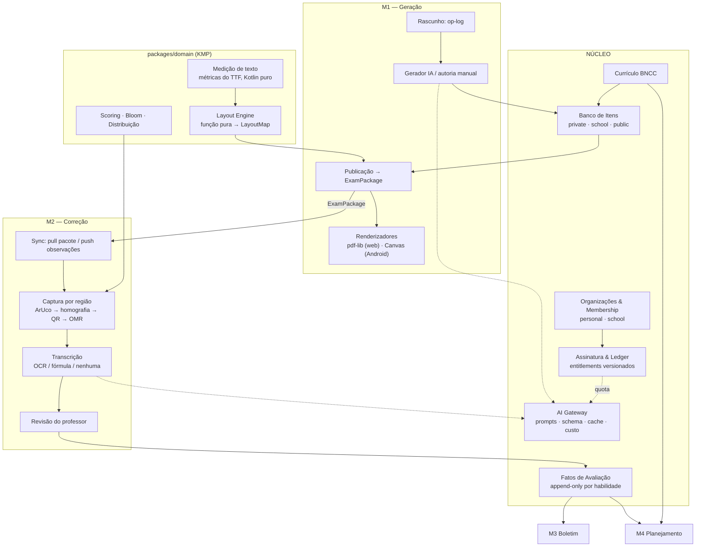

# Arquitetura Final — v3

**Plataforma de Avaliação Educacional com IA**
**Data:** 2026-08-13 · **Mantenedor:** 1 pessoa · **Status:** alinhada, pronta para virar ADRs e specs

> Este documento substitui a v1, a v2 e o documento de design. É a referência única.
> As decisões aqui são invariantes: mudá-las exige um ADR novo, não uma conversa.

---

## 0. Como usar este documento

| Se você quer… | Vá para |
|---|---|
| Entender o sistema inteiro em 5 minutos | §1 e §2 |
| Saber por que uma coisa é do jeito que é | §17 (registro de decisões) |
| Implementar | §15 (roadmap), depois a spec da fatia |
| Modelar o banco | §11 |
| Entender a folha impressa | §7, §8 e `mockup-prova.html` |

---

## 1. O sistema em uma página

Quatro módulos sobre um núcleo comum:

| Módulo | O que faz | Status |
|---|---|---|
| **M1 — Geração** | Cria provas (IA ou manual), publica o `ExamPackage`, renderiza o PDF | Especificado |
| **M2 — Correção** | Captura por região, OMR offline, correção discursiva opcional por IA | Especificado |
| **M3 — Boletim** | Agrega desempenho por habilidade e período | Preparado, não especificado |
| **M4 — Planejamento** | Gera plano de aula a partir das lacunas da turma | Preparado, não especificado |

**A tese central da arquitetura:** M3 e M4 não são módulos novos — são **leituras** sobre fatos que M1 e M2 produzem. Se as invariantes de §2 forem respeitadas, eles custam prompts e read models, não re-arquitetura.

---

## 2. As invariantes

Tudo o mais é negociável. Estas não são.

**I1 — Toda questão nasce marcada por habilidade da BNCC.**
Sem isso, boletim por competência e diagnóstico de turma são impossíveis, e retro-marcar milhares de questões geradas é caro e impreciso.

**I2 — Resultados são fatos append-only atribuídos a habilidade.**
`assessment_fact(aluno, habilidade, avaliação, pontos, período)`. M3 vira `GROUP BY`. M4 vira "quais habilidades estão abaixo do limiar". Nenhuma tabela nova.

**I3 — Todo artefato gerado por IA carrega `prompt_version` + `model_id` + `params_hash`.**
Prompts vivem em arquivos no Git. Sem isso não há reprodutibilidade, auditoria de contestação de nota, nem controle de regressão.

**I4 — Todo item nasce com proveniência e licença.**
Autoria humana, geração por IA ou origem externa, e o que pode ser feito com o item. `visibility: public` é condicionado à licença. É o mesmo argumento de I1: a fatia 6 gera itens em volume, e retro-atribuir milhares depois é caro e impreciso. ADR-0005.

**I5 — Artefato imutável nunca contém dado pessoal direto.**
O que é imutável, hasheado e copiado para dispositivos offline não pode carregar nome, turma ou matrícula: o direito de eliminação não alcança cópia imutável já distribuída. Operacionalizada pela separação do roster. ADR-0002, ADR-0006.

As cinco são verificáveis: cada uma reprova um desenho concreto. Regras que não podem ser reprovadas por teste — "toda tabela com dado pessoal declara finalidade" é a principal — ficam como exigência de ADR e critério de revisão de migration, não como invariante. Invariante que nada consegue reprovar enfraquece as que existem.

---

## 3. Tenancy, planos e a trajetória para Enterprise

### 3.1 O problema da migração — e por que ele não vai existir

A preocupação é legítima: se o professor "pertence" a uma organização pessoal e um dia precisa "virar" membro de uma escola, isso é uma migração de dados dolorosa — re-parentear linhas, quebrar RLS no meio do caminho, deduplicar alunos, reconciliar assinatura.

**O atrito só existe se você assumir que o professor precisa *mudar de lugar*.** A saída é modelar pertencimento em vez de propriedade:

> **`membership` N:N — um usuário pode pertencer a várias organizações simultaneamente.**

É o modelo do GitHub (conta pessoal + organizações) e do Slack (múltiplos workspaces). Com ele, "entrar numa escola" deixa de ser migração e vira **inserção de uma linha**:

| Momento | O que acontece |
|---|---|
| Cadastro | Cria `organization(kind: personal)` + `membership(user, org, role: owner)` |
| Escola contrata | Cria `organization(kind: school)`; admin convida professores |
| Professor aceita | Insere `membership(user, school_org, role: teacher)`. **Nada é movido.** |
| Trabalho novo | Acontece na organização da escola (seletor de contexto na UI) |
| Acervo antigo | Continua na organização pessoal, acessível. Itens podem ser **copiados** para a escola sob demanda, com proveniência via `source_item_id` (já previsto em D5) |

Nenhum UPDATE em massa, nenhuma janela de inconsistência, nenhum aluno duplicado forçado.

### 3.2 As duas regras que preservam isso

1. **Toda tabela de domínio é chaveada por `organization_id`. Nunca por `user_id`.** `created_by_user_id` existe como metadado, jamais como chave de autorização. Escrever uma política de RLS baseada em usuário é o único erro caro possível aqui.
2. **A assinatura pertence à organização, não ao usuário.** Um professor com plano Pro pessoal que também é membro de uma escola no plano Enterprise simplesmente tem direitos diferentes em cada contexto. Sem conflito, sem merge de assinatura.

### 3.3 O que o plano de escola realmente destrava

Já está arquitetonicamente preparado:

| Recurso Enterprise | Preparação já existente |
|---|---|
| Produção conjunta de provas | Op-log de rascunho (D27) + Realtime |
| Banco de itens da escola | `item.visibility: school` (D5) |
| Boletim consolidado da instituição | `assessment_fact` + política de notas por organização |
| Papéis (coordenação, direção) | `membership.role` |

### 3.4 Planos e cobrança

Dois planos no lançamento, sem camada gratuita, cobrança mensal / semestral / anual.

| | **Basic** | **Pro** |
|---|---|---|
| Público | Professor de uma disciplina, 1–2 turmas | Professor com várias turmas |
| Geração de prova por IA | Sim, quota menor | Sim, quota maior |
| Correção objetiva (OMR) | **Ilimitada** — é local, custo marginal zero | Ilimitada |
| Correção discursiva por IA | Não | Sim, com quota |
| Autoria manual | Ilimitada | Ilimitada |

A lógica comercial é sólida e vale registrar porque ela molda a arquitetura: **o Basic vende o fim do Word e a correção rápida, não a IA.** A correção objetiva é ilimitada porque roda no dispositivo e não custa nada — é o recurso mais barato de entregar e o de maior valor percebido diário. A IA generativa é o gancho de conversão para o Pro.

**Modelo técnico — ledger unificado.** Quotas de plano e eventuais pacotes avulsos usam a mesma estrutura, o que evita reescrever a cobrança quando add-ons aparecerem:

- `subscription(organization_id, plan, billing_period, status, current_period_start/end)`
- `credit_ledger` append-only: crédito na virada do período (concessão do plano), débito no uso, crédito em compra avulsa
- **Entitlements como arquivo versionado no Git**, não linhas no banco — mesma disciplina dos prompts. `plans/basic.yaml`, `plans/pro.yaml`
- Verificação de direito em **um único lugar** no domínio, nunca espalhada
- `hold` no enfileiramento e captura na conclusão, para que um job que falha não consuma quota

**Pagamento:** um único provedor que cubra assinatura recorrente, cartão, Pix e boleto no Brasil. É uma integração, não uma arquitetura — deixe para a fatia comercial e não deixe vazar para o domínio: o domínio conhece `subscription` e `ledger`, não o gateway.

---

## 4. Componentes



---

## 5. O `ExamPackage`

Contrato central. Produzido na publicação, **imutável**, com hash, ~110 KB em JSON puro.

```
ExamPackage
├── meta            exam_id, short_id, layout_engine_version, min_renderer_version,
│                   content_hash, fully_offline_gradable,
│                   prompt_version, model_id, params_hash          ← a tripla de I3
├── items[]         enunciado, formato, alternativas, bloom, dificuldade, habilidades BNCC,
│                   rubrica analítica (critérios · descritores · pontos · expected_lines),
│                   assets (SVG de fórmula, imagens), answer_capture_mode
├── variants[]      variant_id, mapa posição física → item_id
├── assignments[]   student_token → student_id, nome impresso, turma, variant_id
├── layout          por variante: páginas, regiões escaneáveis, quads ArUco,
│                   coordenadas normalizadas de bolhas e molduras
├── answer_key      item_id → alternativa correta, pontuação
└── scoring         pesos, composição, nota máxima
```

> **Correção de registro, 2026-09-18 — ADR-0014, decisão 1.** Esta lista trazia `prompt_version` e
> `model_id` e **não** trazia `params_hash`, enquanto **I3 (§2) sempre exigiu os três**. A
> incompletude não se apaga (P7), porque ela **produziu código**: `PackageMeta` foi escrito com dois
> dos três campos, seguindo esta lista, e a KDoc dele passou a afirmar que a fatia 6 preencheria os
> campos "sem mexer no contrato" — falso, porque o terceiro faltava e acrescentá-lo muda o
> `content_hash` de todo pacote. É o achado 4.1 da
> `docs/auditoria-2026-09-18-antes-da-fatia-5.md`.
>
> **Isto não é substituição de decisão:** I3 nunca mudou. Pela precedência do `rigorous.md` §0, a
> invariante vence a prosa descritiva do mesmo documento, e o que aconteceu aqui é o registro
> descritivo alcançando o normativo. A lição que fica é sobre a forma: **uma lista ilustrativa ao
> lado de uma invariante é lida como se fosse a invariante**, e quem implementa segue a que tem os
> nomes dos campos.

**Compressão:** nenhuma explícita. `Content-Encoding` do CDN no transporte e TOAST do Postgres no repouso já entregam ~70%. Comprimir à mão economiza ~77 KB por prova e custa código nos dois clients. **Imagens nunca entram no JSON** — vão para o Storage por referência.

---

## 6. Layout Engine e renderização

A renderização é **100% client-side**. O risco disso — dois renderizadores divergirem e quebrarem o OMR silenciosamente — é neutralizado por quatro mecanismos:

**1. Separação de cálculo e desenho.** O `LayoutMap` é uma função pura no módulo KMP, calculada **uma vez** na publicação e persistida. O PDF é projeção descartável. O OMR lê o `LayoutMap`, nunca o PDF.

**2. Coordenadas normalizadas ao quad.** Dentro de uma região escaneável, tudo é `(u,v) ∈ [0,1]²` do quadrilátero dos 4 ArUcos. Imunidade automática a escala de impressão, tamanho de papel, DPI e distância da câmera.

**3. Geometria rígida isolada de texto fluido.** Enunciados podem reflowar entre renderizadores sem consequência; só as regiões escaneáveis têm geometria fixa. É isto que torna dois renderizadores aceitáveis.

**4. Medição de texto própria.** Este é o keystone e o trabalho mais subestimado do projeto: para o layout ser idêntico entre plataformas, a **medição** precisa ser idêntica — e é exatamente isso que cada plataforma faz diferente. A solução é medição em Kotlin puro sobre tabelas `cmap`/`hmtx`/`kern` extraídas do TTF embarcado, versionadas como recurso. Nenhuma API de plataforma envolvida → resultado idêntico em JVM, Android e JS. ~400–700 linhas.

**Guardas complementares:** fonte embarcada (nunca do sistema); `min_renderer_version` no pacote, com client desatualizado **recusando imprimir**; e teste de paridade em CI que rasteriza o mesmo `LayoutMap` nas duas plataformas e afirma tolerância de 0,3 mm nos centroides de ArUcos e bolhas.

**Renderizadores:** o KMP emite uma lista de primitivas (`DrawRect`, `DrawCircle`, `DrawText`, `DrawImage`, `DrawAruco`); cada plataforma só traduz primitiva → API nativa. ~200 linhas cada. Web: `pdf-lib`. Android: `PdfDocument`/`Canvas`.

**Validação server-side sem renderizar:** o servidor valida o `LayoutMap` publicado (schema, IDs únicos, regiões sem sobreposição, coordenadas em faixa). Custo desprezível, impede que um bug de client publique prova ilegível.

**Matemática:** LaTeX/MathML → **SVG na publicação**, tratado como caixa de dimensão conhecida. Converte tipografia matemática num problema de empacotamento já resolvido. O SVG é armazenado junto ao item.

---

## 7. Design da folha

Referência visual: `mockup-prova.html` (escala real).

**Grade e tipografia.** A4, margens 15 mm laterais e inferior / 14 mm superior, 8 mm reservados para grampo. **Grade vertical de 3 mm** — toda altura de bloco é múltiplo dela, o que torna a paginação um problema de inteiros e alinha o passo das bolhas (6 mm) ao ritmo do texto. Corpo serifado 9,5 pt / entrelinha 1,4; comando da questão em semibold; número pendurado na canaleta esquerda com a pontuação abaixo. Monocromático, tramas ≤ 8%.

**Dados do aluno são impressos, não preenchidos.** Como `exam_assignment` fixa aluno ↔ variante ↔ token na publicação, o nome, a turma e o número já são conhecidos na renderização. Imprimi-los elimina a prova sem nome, o nome ilegível e o aluno que escreve a turma errada — três fontes clássicas de retrabalho. Fica um campo de assinatura opcional, para escolas que exigem.

Consequência: cada folha é única por aluno (já era, por causa de token e variante). A impressão é um PDF colacionado, um documento por aluno.

**Caso de exceção — aluno fora da lista** (transferido, matrícula tardia): a UI gera uma **folha avulsa** com campos em branco e QR contendo apenas prova + variante. A atribuição ao aluno é feita manualmente depois da captura. Sem isso, o modelo de dados impressos vira uma armadilha no dia da prova.

**Folha de respostas no topo da página 1.** Escolha pelo fluxo do professor: uma pilha de provas puramente objetivas é escaneada **sem folhear**. Numa turma de 30, é a diferença entre um minuto e cinco. O **cartão-resposta destacável** existe como **opção** para provas longas, nunca como padrão.

**Mitigação do erro de transcrição.** O bloco consolidado é certo para o produto, mas carrega o salto de linha do aluno. Mitigações: faixa alternada a 4,5% de preto, grupos de 3–5 questões, número em bold à esquerda de cada linha, colunas curtas, letra da alternativa impressa em cinza dentro do círculo. E uma que só existe porque o sistema é digital: **detector de deriva** — se o aluno acerta as primeiras e erra as seguintes com padrão de deslocamento de uma linha, isso é assinatura de salto, não de desconhecimento. Sinalizar ao professor custa poucas dezenas de linhas sobre dados que já existem.

**Geometria (restrições de CV):**

| Parâmetro | Valor |
|---|---|
| Bolha: diâmetro / passo H / passo V / traço | 4,2 mm / 5,2 mm / 6,0 mm / 0,22 mm |
| ArUco: lado gabarito / lado discursiva / zona de silêncio | ≥ 12 mm / ≥ 10 mm / ≥ 1 módulo |
| Pauta discursiva | 8,6 mm (generosa: manuscrito espremido é o pior inimigo da leitura) |

> **Emenda de 2026-09-25 — ADR-0016.** A pauta discursiva passa a ser de **7 mm, em cinza claro**,
> do lado decorativo do ADR-0010, como a letra dentro da bolha: ela é guia para o aluno, e não
> geometria para a câmera. O valor anterior e a razão dele ficam escritos acima (P7). A razão é uma
> hipótese sobre leitura que nunca foi medida, e a medição continua sendo a da linha "Acurácia em
> manuscrito" do §16, agora sobre a pauta nova.

**Paginação.** Medir → agrupar em super-blocos indivisíveis (enunciado+alternativas; enunciado+moldura; texto-base+dependentes com penalidade) → **DP minimizando `Σ(sobra)² + penalidades`** → posicionar regiões → emitir. O quadrado da sobra distribui o vazio em vez de empurrá-lo para o fim. Com N ≤ 60 blocos é O(N²), milissegundos. Colunas: **adaptativo** — 2 por padrão, blocos largos atravessam, 1 quando houver muito conteúdo largo.

> **Emenda de 2026-09-25 — ADR-0019.** A DP acima distribui uma sequência **fixa**: ela nunca muda
> a ordem das questões (`Pagination.kt`). A paginação passa a **redistribuir as questões**: não sobra,
> no meio da prova, espaço onde uma questão caberia de maneira **ideal**, que é inteira, com o
> espaçamento normal e sem nada comprimido.
> - Encaixe forçado é proibido.
> - A ordem do professor desempata. A ordem impressa já era por variante (§5, "mapa posição física
>   → `item_id`").
> - A **numeração impressa é a da folha**, e o gabarito, os chips de completude e os relatórios
>   usam esse número.
> - Os super-blocos se movem inteiros, e a ordem sai determinística.
> - "Com N ≤ 60 blocos é O(N²)" deixa de valer como está escrito: escolher a ordem é empacotamento,
>   e a busca é heurística.

**Área discursiva dimensionada pela rubrica:** `expected_lines` da rubrica define a altura da moldura. A IA gera a questão e a rubrica; a rubrica define o espaço; o espaço condiciona a resposta; a resposta é avaliada contra a mesma rubrica. Uma cadeia só, sem decisão manual. Nunca maior que uma página — se a rubrica pede mais, a questão vira itens (a), (b), (c).

> **Emenda de 2026-09-25 — ADR-0017.** A cadeia acima perde um elo: **a rubrica deixa de definir o
> espaço**, e "sem decisão manual" deixa de valer. O professor declara, questão por questão, o
> número de linhas e a largura, que é uma coluna ou a página, **sem valor padrão**.
> - `expected_lines` continua na rubrica, como o que cada critério espera, e a resposta continua
>   avaliada contra ela.
> - A questão de largura de página ocupa uma faixa própria. O fluxo das colunas continua antes e
>   depois dela. É o "blocos largos atravessam" do parágrafo de paginação, acima.
> - O teto "nunca maior que uma página" fica.

**Economia de papel:** densidade em três níveis (espaçado/normal/compacto) dentro de faixas seguras para o CV, contador de páginas ao vivo, e sugestão automática quando a última página tem menos de 25% de ocupação.

---

## 8. Regiões escaneáveis e pipeline de captura

**Modelo.** Sempre uma região `ANSWER_BLOCK` (gabarito + QR ao lado, dentro de 4 ArUcos). Apenas se houver discursivas, uma região `ESSAY_REGION` por questão, cada uma com 4 ArUcos e um QR compacto.

> **Emenda de 2026-09-25 — ADR-0018.** A região discursiva passa a ter **dois ArUcos na diagonal**:
> `4k` no canto superior esquerdo e `4k+3` no inferior direito. O **QR fica no canto superior
> direito**, na faixa do marcador, e **ancora o terceiro canto**.
> - A alocação `{4k…4k+3}` do parágrafo "IDs de ArUco", abaixo, fica como está.
> - A ordem do pipeline também fica. A primeira homografia sai dos dois ArUcos, o QR é lido na ROI
>   já retificada, e só depois os padrões de posição dele entram num segundo ajuste, que dá o
>   recorte.
> - O canto inferior esquerdo é extrapolado, e a folga do recorte o cobre até a medição em papel.
> - As coordenadas da região discursiva deixam de ser as do "quadrilátero dos 4 ArUcos" do §6, e
>   passam a ser as do retângulo entre os dois marcadores.
> - **O gabarito não muda:** continua com 4 ArUcos.

**A moldura discursiva contém apenas a área de resposta.** O enunciado fica fora. Três razões, em ordem de peso: você já tem o enunciado em texto exato no pacote (fotografá-lo é pagar tokens de visão para reconstruir com erro um dado que você possui); a geometria da região precisa ser previsível; e o recorte limpo evita que o modelo "responda o enunciado" em vez de avaliar a resposta.

**Capturas auto-descritivas.** Cada QR carrega `{exam_short_id}.{student_token}.{variant}.{region_idx}.{crc}`. Com isso **não existe estado de sessão para corromper**: o professor pode escanear fora de ordem, embaralhar folhas, ser interrompido — nada produz atribuição errada. Os ArUcos dão redundância: `region_idx` é validado contra os IDs dos marcadores.

**IDs de ArUco.** Região `k` usa `{4k…4k+3}`, dicionário `DICT_5X5_100` → 25 regiões. Como objetivas não consomem IDs, o teto limita apenas questões discursivas — uma prova com 60 objetivas e 6 discursivas usa 7 regiões. Folgadíssimo.

**Ordem do pipeline (corrige o §7 do SAD-02):**

```
frame → detecta ArUcos → identifica região pelos IDs → homografia
      → decodifica QR na ROI prevista (já retificada) → OMR / recorte
```

O QR é decodificado sobre imagem desempenada — muito mais fácil que sobre a foto em perspectiva — e a busca ocorre em ~15% do frame.

**Escaneamento em lote.** Prova puramente objetiva = uma captura por aluno. O app detecta, confirma por som/vibração e avança sozinho: 30 alunos em cerca de um minuto, sem tocar na tela. Só é seguro porque a captura é auto-descritiva.

**Completude.** O pacote declara o conjunto esperado de `region_idx` por variante; o app mantém o conjunto capturado; a UI mostra chips numerados (verde/cinza/âmbar) e um contador. Variante divergente é rejeitada com mensagem específica. Finalizar incompleto exige confirmação explícita e registra o que faltou.

**Deviants.** Resposta que extrapola muito a moldura é detectada por proporção de tinta fora do quadrilátero e marcada para conferência manual, junto do alerta de deriva de transcrição. É minoria numa turma e corrigir 2 de 30 à mão é efeito colateral tolerável — desde que o sistema **avise**, em vez de corrigir errado em silêncio.

**Modo de cor.** A captura do gabarito é sempre monocromática — o gabarito é preto e branco por construção. O recorte discursivo é cinza por padrão, com `answer_capture_mode: color` como exceção declarada no item (resposta com gráfico colorido, lâmina, mapa). Um toggle na captura permite forçar cor pontualmente e registra o evento; forçar com frequência é sinal de autoria marcada errado.

**Imagens dentro das questões** são coisa distinta: ficam em cor no Storage, mas a publicação gera uma **versão print-safe em cinza** e a autoria **avisa** quando a imagem perde significado em preto e branco ("este gráfico distingue séries por cor"). Impressora de escola é monocromática; descobrir isso depois de imprimir 30 provas é caro.

---

## 9. Correção discursiva e economia de custo de IA

Sua leitura do problema está certa: o custo somado de dezenas de professores corrigindo por imagem é o que pode afugentar escola. Mas a ordem dos ganhos não é intuitiva.

### 9.1 Os números

Uma questão discursiva, turma de 30, prompt fixo (enunciado + rubrica + instruções) ~600 tokens, resposta como imagem ~950 tokens, como texto ~180, saída ~300:

| Caminho | Entrada por turma | Redução |
|---|---|---|
| Imagem, sem cache | 46,5 k | — |
| **Imagem, com cache de prefixo** | **29,1 k** | **37 %** |
| Texto (OCR), sem cache | 23,4 k | 50 % |
| **Texto (OCR) + cache de prefixo** | **6,0 k** | **87 %** |

Três conclusões:

1. **O caching de prefixo é o primeiro lever, não o OCR.** O enunciado e a rubrica são idênticos para os 30 alunos. Estruturar o prompt com o prefixo invariante primeiro corta 37% **sem risco algum de acurácia e sem escrever um modelo**. Fazer isso antes de qualquer outra coisa.
2. **O OCR vale a pena, mas menos do que parece isoladamente** — o ganho grande é a combinação.
3. **Existe um quarto lever maior que os dois:** corrigir contra rubrica analítica explícita é tarefa constrita; um tier de modelo mais barato pode bastar. Validar isso contra um eval set pode render mais que OCR e caching juntos.

### 9.2 O limiar de confiança

`>0,905` é um chute razoável, mas precisa ser calibrado — e sobretudo **calibrado contra a métrica certa**:

> O alvo não é "o texto está perfeito". É **"a nota não muda"**.

Um erro de OCR que não altera o julgamento é inofensivo. Então a calibração é: sobre um corpus real, corrija cada resposta pelos dois caminhos e encontre o limiar acima do qual a divergência de nota fica abaixo do aceitável. Essa métrica quase certamente permite um limiar **mais baixo** que a exigência de texto perfeito — ou seja, mais economia, não menos.

Confiança de OCR é notoriamente **descalibrada** em manuscrito (o modelo erra com convicção), então o número tem que sair de medição, nunca de intuição.

**Rede de segurança auto-calibrante:** guarde sempre a imagem e registre por qual caminho a nota saiu. Se overrides do professor forem sistematicamente mais frequentes no caminho texto, o limiar sobe sozinho. Custo: uma coluna e uma consulta.

### 9.3 TexTeller — viabilidade

Verifiquei. É um vision-encoder-decoder ViT de **0,3 B parâmetros**, com export ONNX, treinado em milhões de pares imagem-fórmula; a versão 3 declara suporte a fórmula manuscrita.

**O que isso significa na prática:**

| Aspecto | Avaliação |
|---|---|
| **Client-side (Android)** | Inviável em v1. 0,3 B em INT8 ≈ 300 MB de download, e decodificação autorregressiva em CPU móvel custa segundos por fórmula, com bateria. |
| **Server-side em CPU** | Plausível. Roda no worker que você já paga, custo marginal próximo de zero — e é aí que ele ganha do LLM de visão. |
| **Custo real de adoção** | Um segundo runtime (Python) ao lado do Kotlin: outro deploy, outra imagem, outra coisa para manter. Contra o objetivo de enxuto. |
| **Segmentação** | Ele reconhece **uma fórmula recortada**. Resposta de exatas é prosa + fórmula + cálculo em várias linhas. Falta uma etapa de detecção de região de fórmula que o TexTeller não faz. |
| **Acurácia no seu domínio** | Suporte a manuscrito é **declarado**, não medido em letra de aluno brasileiro a lápis. Tratar como hipótese a testar. |

**Recomendação: não construir em v1. Construir a costura.**

O `AiGateway` recebe uma abstração `TranscriptionProvider` com implementações intercambiáveis: `NoOp` (manda a imagem), `HandwritingOCR`, `FormulaOCR`. A decisão de qual usar é por item e por confiança. Assim, adotar TexTeller depois é escrever um adaptador — não mexer no pipeline.

E a ordem correta de trabalho é: **medir antes de otimizar.** Na fatia 5 você terá corpus real. Meça qual fração das respostas clareia o limiar; se for baixa (provável em cursiva), o TexTeller não se paga e o caching + tier de modelo resolvem melhor. Se for alta em exatas — onde a escrita tende a ser mais estruturada — aí o investimento se justifica.

---

## 10. Sincronização e offline

Não existe sync bidirecional de entidades mutáveis. Só **pull de referência imutável** e **push append-only**.

| Operação | Rede | Offline |
|---|---|---|
| Gerar prova com IA / publicar | Sim | UI desabilitada com motivo explícito |
| Autoria manual | Não | Ops na fila local |
| Baixar `ExamPackage` | Sim | Gate de pré-voo antes da sessão |
| Renderizar e imprimir | Não | Do pacote em cache |
| Captura + OMR + nota objetiva | Não | Totalmente local e **definitiva** se a prova não tiver discursivas |
| Correção manual de discursiva | Não | Local, entra no outbox |
| Correção por IA | Sim | Enfileirada, executa ao reconectar, debita quota |

**Cache miss:** gate de pré-voo verifica o pacote antes de abrir a sessão; se offline e ausente, **modo degradado** — captura e guarda as imagens brutas para corrigir depois. Nunca falha em silêncio.

**Idempotência:** chave `(exam_id, student_id)` com revisões. Recaptura cria nova revisão; a mais recente é a corrente.

---

## 11. Modelo de dados canônico

**Organização** — `organization(kind: personal|school)` · `membership(user, organization, role)` · `user` · `subscription` · `credit_ledger` · `usage_counter`

**Escolar** — `class_group` · `student(external_ref)` · `enrollment` · `subject` · `term`

**Currículo** — `curriculum_framework` (BNCC, versionada) · `skill(código BNCC)` · `skill_relation`

**Banco de Itens** — `item(visibility, curation_status, source_item_id, content_hash, embedding, answer_capture_mode)` · `item_option` · `item_skill` · `item_rubric_criterion(expected_lines)` · `item_asset(svg/imagem)` · `item_stat(dificuldade empírica, discriminação)`

**Autoria** — `exam_draft` · `exam_draft_op` (append-only)

**Avaliação** — `exam` · `exam_class_group` (atalho de UI) · `exam_variant` · `exam_item` · `exam_layout` · **`exam_assignment`** (fonte da verdade: aluno, variante, token, nome impresso) · `exam_package` (JSON imutável + hash)

**Correção** — `capture_session` · `capture_region` · `answer_observation` (append-only) · `transcription(provider, texto, confiança)` · `grading_result(origin: omr|ai|teacher, path: image|text)` · `grading_criterion_score` · `grade_override`

**Fatos** — `assessment_fact` (append-only)

**Infra** — `sync_cursor` · `outbox_event` · `job` · `llm_call`

---

## 12. Preparação para M3 e M4

Respeitadas I1–I5, sobra pouco a construir:

- **M3 Boletim** = read models sobre `assessment_fact` + política de notas por organização + template de PDF (reusa o Layout Engine). Em organização pessoal, é "relatório da minha turma"; boletim consolidado da instituição é recurso de escola, porque exige as notas de todos os componentes.
- **M4 Planejamento** = diagnóstico (mesmo read model) + retrieval via `pgvector` sobre currículo e itens + prompt versionado + entidade `lesson_plan`.

Componentes construídos em M1/M2 e reusados: `AiGateway`, Layout Engine, Currículo, `pgvector`, ledger.

---

## 13. Stack

**Servidor:** Kotlin + Ktor 3 · **jOOQ** com codegen a partir do schema (drift vira erro de compilação) · migrations pelo Supabase CLI · `kotlinx.serialization` · worker de fila em Postgres com `FOR UPDATE SKIP LOCKED` · Supabase Auth validada por JWKS.

**Banco: PostgreSQL único (Supabase).** Relacional para o núcleo, `jsonb` para layouts e rubricas, **`pgvector`** para o banco de itens e retrieval do M4, full-text `portuguese`, fila de jobs, **RLS** para isolamento por organização. Isso elimina Redis, vector DB, Elasticsearch e camada de autorização artesanal — a razão de a escolha ser certa não é falta de alternativa, é adequação estrutural.

**Compartilhado:** `packages/domain` em KMP — medição de texto, Layout Engine, Bloom, distribuição, scoring, tipos de contrato. Compilado para JVM e Android a partir do mesmo código; divergência é impossível por construção.

**Android:** CameraX · OpenCV (ArUco + homografia) · ZXing-C++ · Room · WorkManager · Compose · `supabase-kt` · ONNX Runtime **condicional** ao resultado da medição de §9.

**Web:** React + TypeScript + Vite + TanStack Query, tipos gerados do OpenAPI. Duas linguagens no projeto é o mínimo alcançável.

**Operação:** Ktor em container no Render · web estático em CDN · Sentry · logs estruturados · tabela `llm_call` com tokens, custo e latência · GitHub Actions.

**Descartados de propósito:** Kubernetes, Redis, broker, vector DB, microserviços, GraphQL.

---

## 14. Workflow OpenSpec + Claude Code + GitHub

```
openspec/
  project.md
  specs/    identity/ billing/ curriculum/ item-bank/ exam-authoring/
            layout-engine/ print/ exam-package/ sync/ capture-omr/
            ai-grading/ reporting/ lesson-planning/
  changes/
docs/adr/
packages/  domain/ (KMP)   contracts/ (OpenAPI + JSON Schema)
apps/      api/ (Ktor)  web/ (React)  android/ (Kotlin)
CLAUDE.md
```

**As sete regras que produzem menos tokens, menos regressão e menos código descartável:**

1. **Contrato antes de código.** Campo novo? Muda `packages/domain` ou `contracts` primeiro, em commit separado. Maior alavanca anti-regressão do projeto.
2. **Um ADR por decisão de §17.** Numerado, imutável, curto. Em vez de reexplicar a cada chat, aponte: "siga o ADR-0006". É isto que dá consistência entre conversas a custo de tokens quase nulo.
3. **`CLAUDE.md` hierárquico e enxuto.** Raiz ≤ 100 linhas: stack, invariantes, padrões proibidos, como rodar testes.
4. **Uma mudança OpenSpec = um PR = um escopo de chat.** Se toca mais de 2 specs, está grande demais.
5. **Três frentes de teste obrigatórias:** golden corpus de CV (~30 folhas fotografadas em ângulos, luz e letras diferentes, com saída esperada, rodando em CI); snapshot de prompts montados; validação de schema em toda saída de LLM mais eval set por prompt.
6. **Fatias verticais, nunca camadas horizontais.**
7. **Schema como fonte de verdade tipada.** Migrations → jOOQ (Kotlin) e OpenAPI → TS. Divergência é erro de compilação, não bug em produção.

---

## 15. Roadmap

| Fatia | Entrega | Valida |
|---|---|---|
| 0 | Schema núcleo · organização + membership + RLS · assinatura inerte | Tenancy e a forma que evita retrofit |
| **1** | **Medição de texto (KMP) · grade de 3 mm · paginação DP · LayoutMap · dois renderizadores · teste de paridade em CI · impressão real medida com régua** | O risco central do render client-side |
| 1.5 | Renderização matemática **em bloco** (LaTeX/MathML → SVG → raster) | Exatas antes de gerar conteúdo de exatas |
| **1.6** | **Matemática em linha · `InlineBox` com largura, altura e `baseline_offset` na medição de texto** | **O caso predominante das exatas — bloqueadora da fatia 6** |
| **2a** | **Um pacote real: `ExamPackage` publicado · validação server-side · PDF nos dois alvos** | **O contrato do pacote, provado pelo menor artefato que pode reprová-lo** |
| **2b** | **Folha completa · cabeçalho e instrução de preenchimento · mitigação do erro de transcrição · orçamento de tinta na região escaneável · folha de teste de impressão** | **A qualidade de impressão, provada pelo que ela consegue reprovar** |
| 3 | Captura por região · ArUco → homografia → QR → OMR normalizado · nota objetiva offline · escaneamento em lote | **Produto já usável e vendável no Basic, sem gastar um token** |
| 4 | Sync · outbox · modo degradado · roster. **Atualizado em 2026-09-10, no archive das duas fatias 4a.** O **gate de pré-voo saiu desta lista**: foi entregue (ADR-0013, `PreparoDaProva.passarPeloGate`; a natureza binária dele vem de ADR-0009) e conferido em aparelho real — a câmera abre só com pacote conferido, e prova sem pacote em modo avião barra com motivo próprio. **Modo degradado continua aqui, e não é o gate:** §10 o define como "se offline e ausente, captura e guarda as imagens brutas para corrigir depois", e hoje esse caso **barra** em vez de capturar — ele depende de fato durável no aparelho, que é o que esta fatia introduz. A condição "não proponha a 4b antes de `slice-4a-cache-referencia` estar arquivada" foi **satisfeita** em 2026-09-10 (`openspec/changes/archive/2026-09-10-slice-4a-cache-referencia`); ela fica escrita porque o ponto de não-retorno do §16 explica por que ela existiu | Modelo offline |
| 5 | Regiões discursivas · completude · deviants · correção manual · **corpus de medição** | D1 sem IA, e os dados para decidir §9 |
| 6 | Op-log de autoria · seed BNCC · `AiGateway` com caching · geração por IA · banco de itens | M1 real |
| 7 | Blueprint/distribuição · variantes · `exam_assignment` · dados impressos · folha avulsa | Randomização e impressão fim a fim |
| 8 | Assinatura, quotas e ledger · correção discursiva por IA · revisão do professor | Fecha M2 e a monetização |
| 9+ | Boletim, depois Planejamento | Valida I1–I5 |

Duas escolhas de ordem que valem defender: a **fatia 1 é o Layout Engine**, porque é onde mora o risco que a renderização client-side criou; e a **fatia 3 já é produto** — prova objetiva corrigida 100% offline é exatamente a proposta de valor do Basic, e ela fica pronta antes de qualquer custo de IA existir.


Uma terceira, acrescentada ao fechar a 1.5: a **fatia 1.6 vem antes da 2**. A 1.5 validou o mecanismo — converter, empacotar como caixa, desenhar igual nos dois renderizadores —, mas a matemática de prova de ensino básico é predominantemente **em linha**, e não em bloco. O gatilho formal é ser bloqueadora da fatia 6: chegar à geração de exatas por IA com a tipografia predominante nunca tendo passado pelo Layout Engine anularia o motivo pelo qual a 1.5 veio antes da 2. A data desejada é mais cedo que isso, e a razão é de contrato: a 1.6 introduz `InlineBox` na medição de texto, e resolver esse tipo antes de a fatia 2 congelar os contratos do `ExamPackage` evita reabrir a medição depois, com o OMR já estabilizado sobre geometria publicada e hasheada.

Uma quarta escolha, acrescentada ao fechar a 1.5: a **fatia 2 foi partida em 2a e 2b**, e o critério do corte é o que a entrega consegue **reprovar**. A 2a entrega o menor pacote publicado de ponta a ponta, e seu critério de aceite são os dois contratos que esse pacote de fato exercita: o **roster mutável separado do pacote imutável** (ADR-0002, I5) e o **perfil tipográfico no cabeçalho do `LayoutMap`** (ADR-0004). Ambos ficam caros depois que houver pacote publicado e hasheado, e ambos falham visivelmente se estiverem errados.

Ficaram deliberadamente **fora** da 2a três itens que uma versão anterior deste plano listava como critério dela: proveniência de item (I4, ADR-0005), identidade de aluno (ADR-0003) e classe de retenção (ADR-0006). Nenhum é exercitado por "publicar uma prova fixa e renderizá-la" — uma prova fixa não tem IA, não produz fatos e não cria tabela de aluno —, então entrariam como declarações que a fatia não pode reprovar. Cada um entra como **commit de contrato antes do consumidor** na fatia que o exercita, e cada um tem fatia-limite e dono em §16. Uma fatia cujo critério de aceite não pode falhar é uma camada horizontal com nome de fatia vertical, e a regra 3 do `CLAUDE.md` existe para impedir isso.

---

## 16. Riscos

| Risco | Avaliação |
|---|---|
| **Divergência entre renderizadores** | Neutralizado por medição própria + normalização + fonte embarcada + guarda de versão + paridade em CI. **Se o teste de paridade não existir, vira o maior risco do projeto.** |
| **Acurácia em manuscrito** | Maior risco não-arquitetural. Não se resolve por arquitetura — meça na fatia 5 antes de construir a 8. |
| **Impressão dos ArUcos** | São 4 por questão discursiva, não 4 por prova: muito mais superfície sujeita a toner fraco. Marcador ≥ 12 mm e folha de teste de impressão no onboarding. **Entregue na 2b:** marcador de 14 mm e uma folha de teste que é um `LayoutMap` do mesmo engine, com o critério de aprovação impresso nela, sujeita às mesmas guardas da prova. |
| **Uso offline não fecha ponta a ponta (§10)** | **Atualizado em 2026-09-24, na `registro-de-divida-executavel` (P7: o texto a seguir fica, e é o estado de 2026-09-08).** Fechado pela `slice-4a-cache-referencia`, arquivada em 2026-09-10. Foi medido em aparelho no mesmo dia: a cadeia inteira aconteceu num processo nascido em modo avião, até a câmera abrir (`docs/cobertura-fatia-4a-cache-referencia.md:112-124`). A linha deste risco no ponto de não-retorno, abaixo, foi reconciliada como paga. **Aberto, descoberto em 2026-09-08 na conferência em aparelho da fatia 4a.** O pacote é puxado, conferido e guardado corretamente, e o cache do aparelho funciona — mas o aplicativo **não abre sem rede depois de o processo morrer**: com credencial guardada, `DeviceSession.abrir` vai a `Consultando` e reconsulta `/me/organizations` incondicionalmente (decisão 10 da fatia 4a-zero), e sem rede o arranque para antes de existir qualquer listagem de provas. Os testes de JVM não pegam isto porque alimentam a máquina de estados direto, e a spec não é violada nos próprios termos: "consulta sem rede diz que está sem rede" e "segunda vez sem rede usa o pacote guardado" convivem, e o segundo pressupõe uma escolha que exige listagem. **Isto é risco de entrega da §10**, e não só cobertura de uma fatia: a promessa de captura offline é do produto. Ver o item de acompanhamento no `design.md` da 4a. **Endereçado por `slice-4a-cache-referencia`, proposta em 2026-09-09**, que acrescentou ao diagnóstico a **segunda parede**: mesmo com a organização resolvida, a listagem de provas vem da API e nada a guarda — resolver só o arranque não fecha a §10. O que falta ao aparelho é a categoria **referência mutável** (nome da organização, título da prova e, na 4b, o roster), que ADR-0002 mandou viver fora do pacote imutável sem dizer onde ela mora no dispositivo. |
| **Custo de IA** | Contido por design: Basic não inclui correção por IA; caching corta 37% de graça; quota por plano limita o teto. |
| **LGPD com dados de menores** | **Encaminhado em 2026-08-27, e não fechado.** ADR-0012 e `docs/legal/politica-de-privacidade.md` fixam base legal por faixa etária, o controlador em cada modalidade — a ambiguidade do *self-serve* estava aqui e o §3.3 da política a resolve —, oito classes de retenção e o conteúdo do contrato de operador. O modo sem identificação nominal deixou de ser mitigação teórica: é o **padrão** de toda organização, e o roster recusa matrícula fora do modo nominal. Toda tabela declara finalidade e classe de retenção, com guarda de construção derivada do catálogo. **Falta**, e continua sendo risco: a coerção do papel na interface e o bloqueio de roster nominal sem contrato de operador registrado (política §3.5 e §4), que vão com a tela de cadastro de aluno; e a retenção executável — expurgo, anonimização da classe B, pedido de eliminação —, que vai com a **fatia 4b**, onde o resultado passa a persistir. **Atualizado em 2026-09-10, no archive das duas fatias 4a:** o **cache no dispositivo** saiu desta lista porque foi entregue — `slice-4a-package-pull` fez o logout apagar o diretório de pacotes da organização, e `slice-4a-cache-referencia` acrescentou a visão guardada à mesma lista e fez a **revogação observada** apagar as duas coisas, conferido em aparelho (`find files -type f` restou só o marcador de perfil). E a atribuição dos três restantes deixou de ser "fatia 4" porque a fatia foi cortada: eles vencem onde resultado persiste, que é a 4b. Atualização de registro com informação nova, não substituição de decisão — não abre ADR. |
| **Um mantenedor, quatro módulos** | Mitigado pelas fatias verticais e por I1–I5: o escopo cresce sem que o núcleo precise ser reescrito. |

### Ponto de não-retorno

Risco sem ponto de não-retorno flutua: fica sempre "para a próxima fatia" até virar retrofit. O caso
da LGPD foi exatamente isso — o item estava certo, o **registro** é que não dizia quando ele deixa de
ser barato. Tabela separada, e não colunas na de cima, porque cinco colunas de prosa não se leem.

**O formato da coluna "Fatia-limite", desde 2026-09-24** (ETAPA 8 do plano de correção; `rigorous.md`
P27). Cada célula começa com um **token entre crases**, e só esse token é lido pela guarda
`tools/divida/divida.mjs`. A prosa que vem depois é para o leitor.

- **O token** é uma fatia (`5`, `2b`, `4a`), `antes-de:<evento>` ou `continuo`.
- **A marca `paga`** vem logo depois do token quando o item foi pago. O limite fica, para que se saiba
  qual era.
- **A fatia corrente** é derivada, e não digitada: é o maior nome `slice-*` em `openspec/changes/`.
- **Quando a guarda reprova, no CI:** quando a fatia de uma linha sem `paga` já passou, ou quando o
  evento dela já ocorreu.
- **Como se reconcilia uma linha vencida:** pagando, ou reagendando para uma fatia-limite nova, com o
  motivo escrito na própria linha.
- **Os eventos** só contam quando declarados na linha abaixo, entre crases. Quem declara um evento
  declara também os que ele implica: `piloto-nominal` implica `primeiro-piloto`.

Isto é atualização de registro, porque muda o formato de uma coluna que já existia, e não
substituição de decisão. Não abre ADR, pelo mesmo critério das atualizações de 2026-09-10.

**Eventos que já ocorreram:** nenhum.

| Risco | Fatia-limite | O que encarece depois dela | Dono |
|---|---|---|---|
| Divergência entre renderizadores | `continuo` · contínuo, verificado a cada CI | **A partir da 2a** já existe geometria publicada e hasheada, e os dois renderizadores desenham a partir dela; divergir passa a quebrar OMR sobre artefato imutável, e não sobre arquivo de trabalho | mantenedor |
| Acurácia em manuscrito | `5` (medir antes de construir a 8) | Construir a 8 sem o número é construir sobre suposição; o critério de reprovação precisa existir antes (ADR-0007) | mantenedor |
| Impressão dos ArUcos | `2b` `paga` · **2b — alcançada** | A folha de teste de impressão existe desde a 2b e reprova uma impressora antes da primeira turma; o que encarece agora é folha já distribuída, e a mitigação é anterior a ela | mantenedor |
| Custo de IA | `6` | Depois da geração em volume, caching e quota viram retrofit sobre uso real | mantenedor |
| **LGPD com dados de menores** | `antes-de:primeiro-piloto` · ~~`3`~~ (primeiro piloto com turma real) | **Reagendada em 2026-09-24, na reconciliação da `registro-de-divida-executavel`, por decisão do mantenedor (P27; o texto a seguir fica).** A guarda do registro de dívida a nomeou vencida na primeira execução: a fatia 3 passou, e a linha não tinha sido paga nem reagendada. Das duas partes que a coluna `Dono` atribui, o **expurgo** foi pago: o da classe H saiu na 4b, e o da classe B ganhou linha própria nesta tabela. A **interface** não existe: nem a coerção do papel no primeiro cadastro de aluno (política §3.5), nem o bloqueio do roster nominal sem contrato de operador (§4). O `3` estava aqui como o momento esperado do primeiro piloto com turma real, que é o parêntese da própria célula, e nenhum piloto aconteceu. O evento é o **primeiro** piloto, e não só o nominal, porque a coerção do §3.5 vale em qualquer modo. Depois do primeiro dado real de menor, a correção envolve dado já coletado. O que era barato antes do primeiro roster foi feito: base legal registrada, modo codificado como padrão e declaração de retenção (ADR-0012). O que encarece agora é o que sobrou — interface e expurgo — porque os dois passam a operar sobre dado coletado | mantenedor, para a interface (fatia 3) e o expurgo (**fatia 4b**); parecer jurídico externo para preencher os campos em aberto da política antes da publicação. **Acrescentado em 2026-09-12:** um dos campos em aberto ganhou linha própria na tabela de ponto de não-retorno — a classe H não enumera o **roster baixado**, e o prazo dela não encaixa em dado que é puxado. Estava registrado só no `design.md` de uma mudança **arquivada**, que é lugar que ninguém lê |
| **Uso offline não fecha ponta a ponta (§10)** | `4a` `paga` · **antes de `/opsx:propose` rodar para a 4b** — a mudança `slice-4a-cache-referencia` precisa estar **arquivada** primeiro | **Paga, e reconciliada em 2026-09-24 na `registro-de-divida-executavel`, porque esta linha não o dizia (P27; o texto a seguir fica).** A guarda do registro de dívida a nomeou vencida na primeira execução: `4a` tinha passado, e a linha tinha a data e não a quitação. A condição desta fatia-limite foi **satisfeita** em 2026-09-10, com o archive de `slice-4a-cache-referencia` antes do propose da 4b (§15). E o risco que ela protegia foi observado no aparelho no mesmo dia: arranque, tela de trabalho, lista e câmera, todos num processo que nasceu em modo avião (`docs/cobertura-fatia-4a-cache-referencia.md:112-124`). É medição de 2026-09-10 e não foi repetida depois. A 4b introduz o **roster** como segundo dado mutável de referência no aparelho. Sem a categoria resolvida antes, a 4b reabre a mesma decisão sob escopo maior e com um consumidor a mais dependendo dela | mantenedor |
| **A classe H não enumera o roster baixado** | `antes-de:piloto-nominal` · **antes de qualquer piloto com turma real em modo `nominal`** | §10.8 da política compreende "pacotes de prova baixados, imagens capturadas e observações pendentes de sincronização" — e **o roster baixado não está na lista**. O prazo dela também não encaixa: "eliminados após a sincronização bem-sucedida" não se aplica a dado que é **puxado**, não empurrado. Depois do primeiro roster nominal num aparelho, enumerar categoria e fixar prazo passa a operar sobre dado pessoal de menor **já copiado para fora do servidor**, e o direito de eliminação deixa de alcançar por um caminho novo. **Em modo `coded` — o padrão de ADR-0012 — o roster no aparelho é código ou apelido, não nome civil:** é isso que mantém a fatia-limite no piloto nominal e não na 4b-1b | **jurídico externo**, levado pelo mantenedor, para a enumeração e para o `[30]` deixar de ser colchete (a linha 12 da política declara os prazos do item 10 como padrões propostos) |
| **O roster cacheado sem regra de apagamento** | `4b` `paga` · **a fatia que puxa o roster para o aparelho — ainda não proposta como mudança, e por isso sem nome de mudança aqui**. **Corrigido em 2026-09-12:** esta linha dizia "a própria 4b-1b", e aquele nome deixou de existir como fatia única — a 4b-1b foi cortada em duas pela regra 3, porque a **rota** que entrega o roster é requisito de `exam-package` e somava uma terceira capability. A fatia-limite é a **segunda** metade, a do aparelho: é ela que cria a cópia local. **E a primeira redação desta correção batizou essa metade com um nome de mudança que ninguém propôs** — fica dito em vez de apagado (P7): nome de mudança entra aqui quando `/opsx:propose` criar a mudança, não antes. **Preenchido em 2026-09-16:** a mudança existe e se chama **`slice-4b-roster-no-aparelho`** — é ela que puxa o roster para o aparelho, e portanto ela que cria a cópia local. A instrução acima foi cumprida como estava escrita: o nome entrou no dia em que a mudança foi proposta, e não antes | É a metade da lacuna acima que **não** depende do parecer, e por isso tem fatia-limite mais curta: enquanto o jurídico não fixa o teto, a leitura restritiva vale como requisito — **o roster cacheado é apagado ao sair e na desinstalação**, no mesmo caminho que a visão guardada e os pacotes já usam (`DeviceSession.sair`, ADR-0013), e **nada além do teto que o parecer fixar é assumido**. Sem isso, a 4b-1b põe uma terceira categoria de dado no aparelho sem dizer quando ela sai — que é exatamente o que o registro da LGPD deixou flutuar uma vez. **Fechado em 2026-09-16 pela `slice-4b-roster-no-aparelho`, com uma correção ao que esta própria linha pedia:** ela nomeava dois caminhos de apagamento — sair e a desinstalação — e **faltava o terceiro**, a revogação de vínculo. Os dois primeiros são o que o usuário ou o sistema fazem; a revogação é o servidor dizendo que a organização não é mais dele, e quem foi removido da escola **não vai sair do aplicativo** para que o apagamento aconteça. O roster entrou nos três, com cenário próprio para cada um e mutações que caem em conjuntos disjuntos. **A desinstalação continua sem teste desta base:** ela é garantia da plataforma — o Android apaga o `filesDir` —, e não do aplicativo; fica dita como herdada, e não como verificada (P8) | mantenedor |
| **A retenção executável da classe B** | `antes-de:primeira-eliminacao` · **antes do primeiro pedido de eliminação de titular, ou do primeiro vínculo de aluno encerrado há 5 anos** | **Acrescentado em 2026-09-17, no `slice-4b-outbox-de-resultado`.** A linha do risco da LGPD atribuía "a retenção executável — expurgo, anonimização da classe B, pedido de eliminação" à fatia 4b, "onde o resultado passa a persistir". O resultado passou a persistir nesta fatia, e **só o expurgo da classe H entrou**: o pendente local é eliminado após a sincronização confirmada. A classe B **não** entrou, e a razão é que ela não tem o que exercitar hoje — o prazo em forma identificável é "enquanto durar o vínculo e por até 5 anos após", e construir a anonimização agora seria política sem consumidor (P18). O que encarece depois é o volume: enquanto há um piloto, anonimizar é uma migration; depois de anos de fatos append-only de várias escolas, é retrofit sobre dado de menor já acumulado | mantenedor, para o expurgo e a anonimização; **jurídico externo** para o pedido de eliminação alcançar fato já gravado |
| **A política §10.8 diverge do comportamento: sair e a revogação preservam o pendente** | `antes-de:publicacao-da-politica` · **antes da publicação da política** | **Acrescentado em 2026-09-17, no `slice-4b-outbox-de-resultado`.** O item 10.8 tem duas frases, e elas não dizem a mesma coisa. O prazo — "eliminados automaticamente **após a sincronização bem-sucedida**" — é o que o código faz. A frase seguinte — "o encerramento de sessão ou a desinstalação do aplicativo eliminam a base local" — **não** é: sair apaga roster, pacote e visão guardada, e **preserva** o resultado pendente, porque ele é o único exemplar de um trabalho já feito e apagá-lo destruiria correção que não existe em nenhum outro lugar. A revogação faz o mesmo. **E isso muda o peso do `[30]` entre colchetes:** para o pendente que ficou sem entregador — usuário revogado, aparelho pessoal, nenhum outro membro da organização para enviá-lo — ele deixa de ser teto de conveniência e passa a ser o **único** limite de dado pessoal que não tem como sair do aparelho por sincronização. Não é mitigado, é **conhecido** | **jurídico externo**, levado pelo mantenedor, na mesma linha em que a classe H e o roster baixado já esperam parecer |
| **Modo degradado (§10) não existe** | `5` | **Acrescentado em 2026-09-18, a partir do achado 2.3 da `docs/auditoria-2026-09-18-antes-da-fatia-5.md`.** §10 promete "se offline e ausente, captura e guarda as imagens brutas"; hoje o gate **barra**. §15 o manteve na fatia 4, a fatia 4 fechou inteira e ele não entrou. Depois da 5 há discursiva no caminho, e o modo degradado deixa de ser "guardar imagem do gabarito" para ser "guardar imagem de tudo". **Onde o registro se dispersou:** §15 ainda o lista na fatia 4; ADR-0013 diz "são 4b e **4c**", e `4c` não existe em §15 nem foi proposta; `docs/cobertura-slice-4b-outbox-de-resultado.md:378` o agrupa com `assessment_fact`, `capture_session` e `sync_cursor` sob "não têm consumidor neste fluxo" — o que vale para aqueles três e **não** vale para este, cujo consumidor é a promessa de produto da §10. **E `openspec/specs/device-session/spec.md:352` afirma o oposto como comportamento corrente**, sem marca de provisoriedade: "Pacote ausente e sem rede SHALL levar à recusa explicada, e SHALL NOT levar a escaneamento." Pelo `rigorous.md` §0 spec não vence arquitetura; o veículo para corrigir esse texto é uma mudança OpenSpec, não esta linha. Adiar é legítimo — adiar **sem fatia-limite e sem dono** é a forma que o item da LGPD tomou até quase virar retrofit. **Atualização de registro com informação nova, não substituição de decisão — não abre ADR**, pelo mesmo critério da atualização de 2026-09-10 acima | mantenedor |
| **Migration não é aplicada por nenhum pipeline** | `antes-de:migration-da-5-em-producao` · **antes de a primeira migration da fatia 5 ir a produção** | **Acrescentado em 2026-09-18, a partir do achado 4.6 da auditoria.** Já cobrou: código novo contra schema antigo deu **HTTP 500** na conferência da 4b, com `/health` em 200 o tempo todo (`docs/cobertura-slice-4b-outbox-de-resultado.md` §5.1.1, item 2). A 5 acrescenta schema (rubrica, transcrição), então a próxima migration é certa. Estava registrado em `docs/deploy-api.md:423` — "Nada neste caminho as roda a cada deploy, e uma migration nova exige repetir o passo à mão" —, mas na seção "o que este roteiro não cobre", que é lista de ausências e não tabela de ponto de não-retorno: item que já produziu incidente em produção e segue sem data é a definição operacional de flutuar | mantenedor |
| **O limiar do OMR foi apurado sobre um aparelho e uma impressora** | `5` (é a fatia do corpus) | **Acrescentado em 2026-09-18, a partir do achado 4.7 da auditoria.** A obrigação de reexaminar `V` e `C` foi registrada na 3b, venceu na 3c e ficou "continua aberta" sem novo prazo nem novo dono. §14 regra 5 pede ~30 folhas em ângulos, luz e **letras diferentes**; há 9 fotos de 3 folhas, e o eixo "letras diferentes" não existe. E **2 das 9 não decodificam o QR**, sem causa medida — as duas hipóteses testadas na 3b (resolução e tamanho de arquivo) caíram, e investigar foi adiado para uma "fatia própria" que não existe. A correção objetiva offline **já é o produto** (§15: a fatia 3 "já é produto … a proposta de valor do Basic"), e ela está calibrada sobre uma impressora e um telefone. Vence junto com a linha de acurácia em manuscrito, que já está nesta tabela com a mesma fatia-limite e pela mesma razão: a 5 é a fatia do corpus | mantenedor |
| **A regra de extração de dados não existe abaixo da API 31** | `antes-de:piloto-nominal` · **antes de qualquer piloto em modo `nominal` num aparelho abaixo de Android 16** | **Acrescentado em 2026-09-18, no `transferencia-entre-aparelhos`.** A mudança fechou o achado 4.3 da auditoria: com `dataExtractionRules` negando os quatro domínios, o transporte de transferência passou a cancelar o pacote por não haver dado, com o roster e o `outbox.db` intactos no disco (`docs/cobertura-transferencia-entre-aparelhos.md` §10.2 e §10.3). **O que sobra é a faixa em que o mecanismo não existe:** `dataExtractionRules` é da API 31 em diante e o `minSdk` é **26**, então em Android 8 a 11 o arquivo é ignorado e nada o substitui — `fullBackupContent`, o equivalente pré-31, governa backup em nuvem, que `allowBackup="false"` já barra. **E a medição é de Android 16 apenas:** Android 12 a 15 declaram o mesmo mecanismo e não foram exercitados. Ler a documentação e concluir que está tudo bem é exatamente o que produziu o achado 4.3 — a faixa fica aberta como **conhecida, e não mitigada** (P8), até ser medida num aparelho de cada extremo. O que encarece depois é o piloto: o modo `nominal` põe nome civil de menor no roster, e um aparelho antigo na sala é indistinguível de um novo para quem entrega a prova | mantenedor |
| ~~**A afirmação de que a credencial não fica em claro depende da ordem da suíte**~~ **fechado em 2026-09-23** | `antes-de:lancamento` `paga` · **antes do lançamento** | **Fechado em 2026-09-23, na `o-apk-de-release-e-verificado` (ETAPA 7.2); o texto depois deste parágrafo fica, e duas afirmações dele estavam erradas (P7).** A **ordem** não era a causa: a suíte de 78 testes que caía em 19/09, recomposta, passou três vezes, e a árvore daquela hora também passou, no emulador e no próprio aparelho. E não era "a mesma classe de defeito que 3.2": a falha foi **reproduzida** no aparelho de 19/09 (2511FPC34G, Android 16), uma vez em dezenove, sem defeito plantado, com a pilha — `FileNotFoundException … ENOENT` em `SessaoEmRepousoInstrumentedTest.kt:83`, a guarda 1 lendo o arquivo entre um `exists()` e um `readBytes()` enquanto o `SharedPreferences` o regravava (renomeia para `.bak` e escreve outro). A causa estava **no teste**, e não no produto. Consertada ali: as leituras de sondagem deixam de fazer `exists()` antes, e "ausente no meio da regravação" vira "ainda não"; nenhuma asserção nem espera mudou. **A afirmação de segurança foi vista falhar pelo motivo certo**, e só ela, com o token plantado em claro no produto — isolada, na ordem que caiu e na suíte cheia, no emulador e no aparelho. **O limite, e ele fica:** a corrida não se força, então o fechamento é por construção e pela pilha, e não por contagem — dezesseis execuções no aparelho depois do conserto, sem queda, não provariam nada sozinhas numa corrida de 1 em 19. `docs/cobertura-o-apk-de-release-e-verificado.md` §4 e Parte II. **Acrescentado em 2026-09-19, no `o-pendente-nao-se-perde-no-aparelho`.** Achado **novo**, encontrado ao medir a linha de base da ETAPA 5, e registrado em vez de consertado em silêncio (regra 0.4 do plano de correção, P19; entra aqui por ser de segurança, P20). `SessaoEmRepousoInstrumentedTest.aCredencialNaoEstaEmClaro` apaga os `shared_prefs` em `@Before` e espera o keyset do Tink reaparecer. **Na suíte cheia caía de forma reprodutível** — duas execuções, `2026-09-19T00:03:49Z` e `00:06:02Z`, com `FileNotFoundException` no arquivo cifrado; **isolada, passa** — duas execuções. É interferência de ordenação, não defeito do produto. **Depois desta mudança parou de cair, e isso não é conserto:** acrescentar uma classe instrumentada mudou a ordem de execução, e a fragilidade continua inteira. O que está em jogo é o que o cenário afirma — que o token não aparece como texto legível no armazenamento do aplicativo. Um cenário que cai por interferência é lido como flaky e ignorado; um que passa por acidente de ordem pode voltar a cair, ou continuar verde sem estar medindo. É a mesma classe de defeito que 3.2: uma instância em cache sobrevivendo ao apagamento do arquivo que ela representa. `docs/cobertura-o-pendente-nao-se-perde-no-aparelho.md` §1 e §6. **O veículo é o item 4 da 7.2 do `docs/plano-de-correcao-antes-da-fatia-5.md`**, ao lado dos outros três itens que são a mesma coisa — guarda que pode parar de verificar o que afirma sem nada acusar —, e com a mesma fatia-limite: prazo sem veículo é o que esta tabela existe para impedir | mantenedor |
| **`assessment_fact` não existe** | `9` (a fatia que o consome) | **Acrescentado em 2026-09-24, na `registro-de-divida-executavel`, por decisão do mantenedor, a partir do §9 do `docs/plano-de-correcao-antes-da-fatia-5.md`.** O plano trazia este prazo só em prosa, e o ponteiro do `CLAUDE.md` para ele sai no archive desta mudança. A P27 existe para que isso não aconteça: item adiado com dono sem linha nesta tabela não tem data. **O adiamento é correto, e esta linha não o contesta.** O append-only de I2 está garantido nas duas tabelas de resultado, o insumo (`item_id`, `worth`, `earned`) está gravado em `answer_observation`, e a dimensão por habilidade é derivável por junção com o pacote imutável (auditoria de 2026-09-18, §6). O fato ficou fora da 4b junto com `capture_session` e `sync_cursor` (`docs/cobertura-slice-4b-outbox-de-resultado.md:379`). **O que encarece:** a fatia 9 o consome. I2 define o boletim (M3) como `GROUP BY` sobre `assessment_fact`, e chegar à 9 sem a tabela seria construir o consumidor sem o fato | mantenedor |
| **O APK de release sai sem assinatura e sem R8, com `versionCode = 1`** | `antes-de:lancamento` · **fatia comercial** (plano de correção, §9) | **Acrescentado em 2026-09-24, na `registro-de-divida-executavel`, por decisão do mantenedor, a partir do §9 do `docs/plano-de-correcao-antes-da-fatia-5.md`**, que o trazia só em prosa, como "trabalho de lançamento". A ETAPA 7 do plano proibiu os três de propósito. Assinar e mexer em `versionCode` "é trabalho de lançamento, não de correção de auditoria". Ligar `minifyEnabled` "muda o artefato e abre uma frente de verificação inteira". **Conferido por leitura em 2026-09-24:** `apps/android/build.gradle.kts` não tem `buildTypes`, `signingConfig` nem `isMinifyEnabled`, e declara `versionCode = 1`. **O token é o evento, e não um número.** "Fatia comercial" não é linha do §15, e o que o item bloqueia é a entrega do APK ao professor, que o §2 do plano, sobre a 7.2, já chama de "o **lançamento**". **O que encarece:** a frente de verificação que o R8 abre (plano, ETAPA 7). Antes do lançamento, ela se faz sobre um APK que ninguém recebeu. Depois, se faz sobre o que o professor já tem instalado | mantenedor |
| **A região discursiva ainda não passou pelo aparelho nem pelo papel** | `5b` · **a mudança da captura discursiva e da completude** — ainda não proposta, e por isso sem nome de mudança aqui | **Acrescentado em 2026-09-24, na `slice-5a-regiao-discursiva`, por decisão do mantenedor** (decisão 12 do `design.md` dela). A 5a publica prova com discursiva e a leva ao documento nos dois renderizadores. Duas coisas ficam sem veículo nela, e as duas têm o mesmo: a mudança que fotografa folha discursiva impressa. **O aparelho recusa pelo motivo errado.** Uma prova com discursiva chega ao aparelho e é recusada na apuração com "itens lidos divergem da variante", porque a discursiva está em `positions` e o gabarito não a lê. Não sai nota errada, mas o motivo engana o professor, e o caminho do `RegionDetector` diante de marcadores `4…7` no quadro **não foi exercitado** — é suposto. **Correção de 2026-09-25 (P7): as duas frases anteriores estão erradas, e ficam.** A recusa "na apuração" nunca seria alcançada. Lido no código da `main`, e **não medido**: o aplicativo **cai** ao abrir a câmera, porque `ScanActivity.kt:218` escolhe a região com `map.regions.single()`, que lança exceção com as três regiões da prova com discursiva. E, se não caísse, toda captura falharia, porque `RegionDetector.declaredMarkersOf` conta os ArUcos da **página** inteira, e não os da região: na página 0 da fixture discursiva são 8, contra os 4 esperados. A primeira afirmação veio da leitura do domínio, e o caminho da câmera não tinha sido olhado. Achado na exploração da 5b, que foi dividida em duas por decisão do mantenedor. A **5b-1** reconhece a folha com discursiva, e é ela que conserta isto. O prazo e o dono desta linha não mudam: muda a gravidade descrita, que passa de mensagem enganosa a queda do aplicativo. **A folha discursiva não foi medida em papel.** A 5a mede o documento, com fidelidade e paridade nos dois renderizadores, e não a impressão: a geometria da região discursiva usa as mesmas primitivas e o mesmo tamanho de marcador que a do gabarito, e isso é **herdado** da 2b e da 3b, não verificado. O que encarece depois: a 5c põe a correção manual sobre essa captura, e corrigir a identificação da região depois de haver nota discursiva gravada é retrofit sobre fato append-only. **Não é mitigado, é conhecido** (P8) | mantenedor |
| **Implantar a API da 5a faz o servidor responder HTTP 500 a resultado das provas antigas** | `antes-de:implantar-api-da-5a` · **antes de implantar no Render uma imagem que contenha a `slice-5a-regiao-discursiva`** (a primeira é `sha-a8ccf1a`, publicada em 2026-09-24 e não implantada) | **Acrescentado em 2026-09-24, depois do archive da `slice-5a-regiao-discursiva`, por decisão do mantenedor.** Achado ao olhar o que o servidor faz com os pacotes que já estão em produção, que a 5a não conferiu. A rota de resultados lê o `content` do pacote gravado com o tipo do domínio (`conferirProveniencia`, `ProvenienciaDoResultado.kt:64`), e a 5a tornou `qr_id` obrigatório na região. Os dois pacotes em produção, `prova-referencia-slice-1` e `prova-referencia-slice-2` (lidos no banco em 2026-09-24, `docs/cobertura-slice-5a-regiao-discursiva.md`), não o têm. **A falha de leitura é medida:** é o mesmo `ExamPackage.JSON` com que o pacote congelado de antes da 5a cai no parse (tarefa 4.4). **O 500 é por leitura, e não medido:** a rota não trata a exceção, e a KDoc dela decide que "a exceção sobe" porque "um `content` que não parseia é pacote corrompido no banco" — premissa que a 5a desfez, porque agora há pacote íntegro de contrato antigo. Quem é atingido: só um aparelho com build anterior à 5a que ainda tenha resultado pendente dessas provas; o aplicativo atualizado nem as abre. E o aparelho trata 500 como falha transitória, então o pendente ficaria reenviando sem fim. **Como se paga:** antes do deploy, conferir que nenhum aparelho tem resultado pendente das duas provas, ou decidir por escrito que esses resultados de conferência são descartáveis; e declarar o evento aqui quando o deploy acontecer. Corrigir o servidor para recusar com motivo, e não 500, fica como alternativa se aparecer pendente real. O que encarece depois: um resultado de verdade parado num aparelho, reenviando contra um 500, sem ninguém ver | mantenedor |
| **A folha de teste de impressão não aprova a região discursiva que a prova imprime** | `5b` · **a mudança que vem depois do filtro de marcadores por região** (tarefa 1.1 da `slice-5b-1-o-aparelho-reconhece-a-discursiva`) — ainda não proposta, e por isso sem nome de mudança aqui | **Acrescentado em 2026-09-25, na `slice-5b-0-a-regiao-discursiva-compacta`, por decisão do mantenedor** (decisão 9 do `design.md` dela). A folha de teste existe para reprovar uma impressora antes de ela imprimir uma turma (D-2b.7), e a 5b-0 a faz deixar de aprovar o que a prova imprime, por duas razões. **Ela aprova marcador de 14 mm**, e o marcador da região discursiva passa a ter 11,2 mm (ADR-0018). **Ela não tem pauta cinza**, e a pauta passa a ser linha cinza abaixo do teto decorativo (ADR-0016), justamente o que uma impressora fraca apaga. **Por que ela não muda na 5b-0:** na `main`, o `RegionDetector` conta os ArUcos da página inteira, e não os da região; o filtro por região é a tarefa 1.1 da 5b-1, que não está na `main`. Um marcador a mais na página da folha de teste derrubaria os três testes instrumentados que a leem (`CorpusInstrumentedTest`, `RegionDetectorInstrumentedTest` e `SheetReaderInstrumentedTest`, *conferido por `grep` em `apps/android/src/androidTest` em 2026-09-25*). O veículo é uma mudança posterior ao filtro. O que encarece depois: uma escola aprova a impressora pela folha de teste, e a discursiva sai com marcador ou pauta que aquela folha nunca conferiu — a turma impressa com uma região que a câmera pode não ler, ou com uma pauta que o aluno não vê | mantenedor |
| Um mantenedor, quatro módulos | `continuo` · contínuo | — | mantenedor |

---

## 17. Registro de decisões

**Aceitas (viram ADR):** D1 offline redefinido · D3 OMR template-driven · D4 nota no servidor, offline definitivo sem discursivas · D5 banco de itens com tiers de visibilidade · D6 QR com identidade e CRC · D7 multimodal-first · D8 pull de referência + push append-only · D9 gate de pré-voo e modo degradado · D10 revisão humana obrigatória · D11 UUIDv7 · D12 Bloom versionado · D13 maior resto estratificado · D14 override do professor vence · D15 provedor único atrás do `AiGateway` · D16 Storage separado com retenção · D17 BNCC obrigatória na geração · D18 sessão por regiões · D19 idempotência por revisão · D20 versionamento de prompt e modelo · D21 Room · D22 remover `OpenScanVision` · D23 QR repetido por região · D24 guarda de versão de renderizador · D25 ledger unificado · D26 `exam_assignment` fixado na publicação · D27 op-log de rascunho · D28 pipeline de imagem · D29 `DICT_5X5_100` com quad único · D30 sem compressão explícita · D31 gabarito no topo, cartão destacável como opção · D32 colunas adaptativas · D33 matemática via SVG · D34 atomicidade e agrupamento · D35 área dimensionada pela rubrica · D36 fonte embarcada · D37 densidade em três níveis · D38 detector de deriva.

> **Emendas de 2026-09-25:**
> - **D35, pela ADR-0017:** o espaço da discursiva, com linhas e largura, é declarado pelo
>   professor, e não pela rubrica.
> - **Pauta do §7, pela ADR-0016:** 7 mm, em cinza claro.
> - **Modelo de região do §8, pela ADR-0018:** a região discursiva tem dois ArUcos, e o QR ancora o
>   terceiro canto.
> - **Paginação do §7, pela ADR-0019:** as questões são redistribuídas para não deixar branco, e a
>   numeração impressa é a da folha.

**Rejeitada:** D2 render server-side — substituído por Layout Engine compartilhado + renderizadores client-side.

**Novas nesta versão:**

| # | Decisão |
|---|---|
| **D39** | `membership` N:N — usuário pertence a várias organizações. Entrar numa escola é inserir uma linha, não migrar dados. Toda tabela chaveada por `organization_id`, nunca por `user_id`. |
| **D40** | Assinatura por organização; entitlements como arquivo versionado no Git; quotas e avulsos no mesmo ledger; verificação de direito em um único ponto do domínio. |
| **D41** | Imagens de enunciado guardadas em cor, com versão print-safe em cinza gerada na publicação e aviso de autoria quando a imagem perde significado em P&B. Captura do gabarito é sempre monocromática. |
| **D42** | `TranscriptionProvider` plugável (`NoOp` / `HandwritingOCR` / `FormulaOCR`). Caching de prefixo **antes** de qualquer OCR. Limiar calibrado contra "a nota não muda", nunca contra texto perfeito. Rede de segurança auto-calibrante via overrides. |
| **D43** | TexTeller não entra em v1. Costura pronta; server-side se algum dia; decisão condicionada à medição da fatia 5. |
| **D44** | Dados do aluno impressos, não preenchidos. Folha avulsa com campos em branco para aluno fora da lista. |
| **D45** | Deviants detectados por proporção de tinta fora do quadrilátero e enviados ao mesmo canal de conferência manual do detector de deriva. |

**Novas ao fechar a fatia 1.5 (viram ADR):**

| # | Decisão | ADR |
|---|---|---|
| **D46** | Roster mutável — nome, turma, matrícula — fora do `ExamPackage` imutável e fora do `content_hash`. Sem segundo hash: integridade do impresso já vem do QR. | ADR-0002 |
| **D47** | Identidade de aluno unificada por `student_alias` append-only, resolvido em read model. Nenhum fato é reescrito. | ADR-0003 |
| **D48** | O `LayoutMap` declara o perfil tipográfico que o produziu. Campo antes da parametrização. | ADR-0004 |
| **D49** | Todo item nasce com proveniência e licença; `visibility: public` condicionado à licença. Vira I4. | ADR-0005 |
| **D50** | Artefato imutável nunca contém dado pessoal direto (I5). Finalidade e classe de retenção por tabela ficam como exigência de ADR, não como invariante. | ADR-0006 |
| **D51** | Critério de aprovação de toda medição que decide é registrado antes da primeira execução. | ADR-0007 |
| **D52** | O branco em volta da fórmula em bloco é derivado da transição de texto, assimétrico, e não varia com a altura da fórmula. | D-1.5.9 (fatia 1.5) |
| **D53** | O pacote publicado é armazenado como texto canônico, e não como `jsonb`: o hash é sobre os bytes, e `jsonb` guarda árvore normalizada. | ADR-0008 |
| **D54** | Uma prova publicada tem exatamente um pacote; corrigir prova publicada é publicar prova nova, com `short_id` próprio. O QR impresso não carrega identificador de pacote (§8). | ADR-0009 |
| **D55** | Tinta decorativa dentro de região escaneável tem orçamento declarado no artefato publicado: cobertura ≤ 12% na bolha não respondida, caneta ≥ 50%, corredor de 20% a 40% para o limiar do OMR. Se a medição reprovar, a decoração cede. | ADR-0010 |
| **D56** | Tom e trama são fração de preto em permilagem, declarados no `LayoutMap`; renderizador não escolhe tom. Quem julga cobertura de tinta é o documento rasterizado, e não a validação sem renderizar — o programa de fonte não conhece o contorno do glifo. | D-2b.1, D-2b.3.1 (fatia 2b) |

**Aberto** — cada item com o ponto em que deixa de ser barato. Um item sem essa coluna volta a flutuar, que foi o que aconteceu com a LGPD.

| Item | Fatia-limite | O que encarece depois dela | Dono |
|---|---|---|---|
| Base legal e política de retenção sob LGPD | **3** | Dado real de menor já coletado; sem escola controladora no Basic (§16) | mantenedor + jurídico externo |
| Unicidade de `skill` por versão do framework curricular | **6** (seed BNCC) | Código BNCC reusado entre versões quebra comparação longitudinal em silêncio; `skill_relation` cobre o mapeamento entre currículos, não a unicidade | mantenedor |
| `subscription.origin` — distinguir empenho de cartão | **8** | Backfill adivinhado sobre assinaturas já existentes. Hoje é uma coluna numa tabela sem linhas em produção | mantenedor |
| Garantia executável de que o recorte discursivo não contém cabeçalho | **5** | A moldura já exclui o enunciado por geometria (§8), mas nada afirma isso; o nome do aluno é impresso na folha | mantenedor |
| Injeção de prompt manuscrita pelo aluno, no eval set | **5** | Validação de schema garante forma, não conteúdo: resposta adversarial produz JSON válido com nota errada | mantenedor |
| Fórmula em bloco seguida de mais enunciado | **1.6+** | Exige o corpo da questão virar sequência de blocos — contrato maior que `InlineBox`, e não sai de graça junto com ele | mantenedor |
Três itens desta lista não viraram ADR de propósito — unicidade de `skill`, `subscription.origin` e a garantia de recorte. São decisões de um campo ou de um cenário de spec, e um ADR por coluna de tabela esvazia o instrumento. Ficam aqui, com data-limite e dono, que é o que faltava.

**Saiu da lista ao fechar a 2a.** A parametrização de `Sheet` foi entregue na 1.6, como `LayoutProfile`, e o campo de perfil entrou no `LayoutMap` na 2a (ADR-0004) — as duas metades cumpridas dentro do prazo que a lista registrava. `CaptureGeometry` **não** foi parametrizada, e isso é decisão e não pendência: geometria de bolha está amarrada às tolerâncias de OMR do ADR-0001 e só se mexe com evidência de captura sob outra escala. Um teste afirma que perfil nenhum a altera.

---

*Fontes consultadas para a análise do TexTeller (§9.3):*
[TexTeller — repositório](https://github.com/OleehyO/TexTeller) · [TexTeller no Hugging Face](https://huggingface.co/OleehyO/TexTeller)
